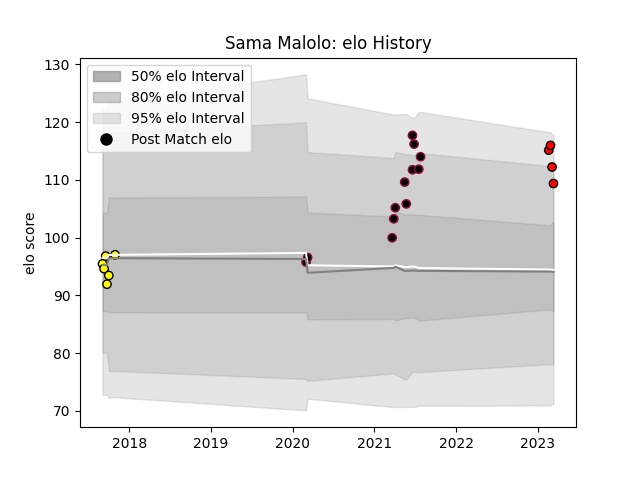

---  
layout: page  
title: Sama Malolo  
date: 2023-03-21 18:23:35.930948  
categories: player  
---
# Sama Malolo

Last updated: 2023-03-21
## Positions: H

## Current elo: 109.0

## Current Percentile: 88.0

# Elo History

# Match History

| Team             |   Appearances |   Win Rate |
|:-----------------|--------------:|-----------:|
| Utah Warriors    |            12 |   0.583333 |
| Perth Spirit     |             6 |   0.666667 |
| San Diego Legion |             4 |   0.75     |

| Opponent               |   Matches |   Win Rate |
|:-----------------------|----------:|-----------:|
| L. A. Giltinis         |         3 |   0.333333 |
| Houston SaberCats      |         2 |   0.5      |
| New England Free Jacks |         2 |   0.5      |
| Austin Herd            |         1 |   1        |
| NOLA Gold              |         1 |   0        |
| Toronto Arrows         |         1 |   1        |
| Seattle Seawolves      |         1 |   1        |
| Rugby New York         |         1 |   1        |
| R.U. New York          |         1 |   1        |
| Queensland Country     |         1 |   1        |
| Melbourne Rising       |         1 |   1        |
| Brisbane City          |         1 |   1        |
| Greater Sydney Rams    |         1 |   1        |
| Fijian Drua            |         1 |   0        |
| Dallas Jackals         |         1 |   1        |
| Colorado Raptors       |         1 |   0        |
| Canberra Vikings       |         1 |   0        |
| Utah Warriors          |         1 |   1        |