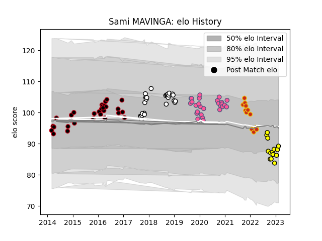

---  
layout: page  
title: Sami MAVINGA  
date: 2023-02-02 15:50:42.049086  
categories: player  
---
# Sami MAVINGA

## Positions: P

## Current elo: 93.0

## Current Percentile: 28.0

# Elo History

# Match History

| Team                 |   Appearances |   Win Rate |
|:---------------------|--------------:|-----------:|
| Lyon                 |            30 |   0.733333 |
| Stade Francais Paris |            28 |   0.410714 |
| Newcastle Falcons    |            26 |   0.461538 |
| Carcassonne          |            13 |   0.576923 |
| Perpignan            |            11 |   0.181818 |

| Opponent             |   Matches |   Win Rate |
|:---------------------|----------:|-----------:|
| Bordeaux Begles      |         6 |   0.5      |
| La Rochelle          |         5 |   0.8      |
| Toulon               |         5 |   0.2      |
| Edinburgh            |         4 |   0.25     |
| Bayonne              |         4 |   0.5      |
| Montpellier Herault  |         4 |   0.375    |
| Colomiers            |         3 |   0.333333 |
| Clermont Auvergne    |         3 |   0.333333 |
| Aurillac             |         3 |   1        |
| Lyon                 |         3 |   0        |
| Stade Toulousain     |         3 |   0.666667 |
| Pau                  |         3 |   0.333333 |
| Wasps                |         3 |   0.333333 |
| Bristol Rugby        |         3 |   0        |
| Newcastle Falcons    |         2 |   0.5      |
| Montauban            |         2 |   1        |
| Ospreys              |         2 |   0        |
| Agen                 |         2 |   1        |
| Racing 92            |         2 |   0        |
| Rouen                |         2 |   1        |
| Saracens             |         2 |   0        |
| Stade Francais Paris |         2 |   0        |
| Tarbes               |         2 |   0.5      |
| Worcester Warriors   |         2 |   1        |
| Sale Sharks          |         2 |   0.5      |
| Zebre                |         2 |   0.5      |
| London Welsh         |         2 |   1        |
| Beziers              |         2 |   1        |
| Leicester Tigers     |         2 |   0        |
| Grenoble             |         2 |   0.75     |
| Gloucester Rugby     |         2 |   0.5      |
| Carcassonne          |         2 |   1        |
| Castres Olympique    |         2 |   1        |
| Soyaux-Angouleme     |         1 |   0        |
| Bath Rugby           |         1 |   1        |
| Vannes               |         1 |   0        |
| US Bressane          |         1 |   1        |
| Biarritz Olympique   |         1 |   1        |
| Bourgoin-Jallieu     |         1 |   0        |
| Brive                |         1 |   0        |
| Dax                  |         1 |   1        |
| Cardiff Blues        |         1 |   1        |
| London Irish         |         1 |   1        |
| Exeter Chiefs        |         1 |   0        |
| Provence Rugby       |         1 |   1        |
| Perpignan            |         1 |   1        |
| Oyonnax              |         1 |   0        |
| Northampton Saints   |         1 |   1        |
| Nevers               |         1 |   1        |
| Narbonne             |         1 |   1        |
| Mont-de-Marsan       |         1 |   0        |