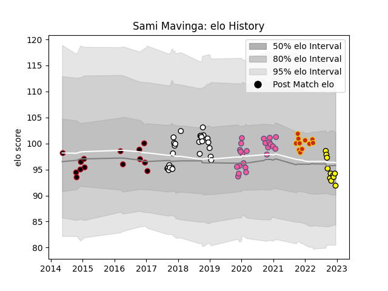

---  
layout: page  
title: Sami Mavinga  
date: 2022-12-14 11:15:56.692583  
categories: player  
---
# Sami Mavinga

## Positions: P

## Current elo: 94.0

## Current Percentile: 41.0

# Elo History

# Match History

| Team                 |   Appearances |   Win Rate |
|:---------------------|--------------:|-----------:|
| Newcastle Falcons    |            26 |   0.461538 |
| Stade Francais Paris |            23 |   0.413043 |
| Lyon                 |            14 |   0.571429 |
| Perpignan            |            11 |   0.181818 |
| Carcassonne          |            10 |   0.6      |

| Opponent             |   Matches |   Win Rate |
|:---------------------|----------:|-----------:|
| Toulon               |         5 |   0.2      |
| Bordeaux Begles      |         5 |   0.6      |
| Montpellier Herault  |         4 |   0.375    |
| Edinburgh            |         4 |   0.25     |
| La Rochelle          |         4 |   1        |
| Wasps                |         3 |   0.333333 |
| Bristol Rugby        |         3 |   0        |
| Stade Toulousain     |         3 |   0.666667 |
| Clermont Auvergne    |         3 |   0.333333 |
| Pau                  |         3 |   0.333333 |
| Newcastle Falcons    |         2 |   0.5      |
| Ospreys              |         2 |   0        |
| Lyon                 |         2 |   0        |
| Racing 92            |         2 |   0        |
| Sale Sharks          |         2 |   0.5      |
| London Welsh         |         2 |   1        |
| Stade Francais Paris |         2 |   0        |
| Worcester Warriors   |         2 |   1        |
| Saracens             |         2 |   0        |
| Zebre                |         2 |   0.5      |
| Castres Olympique    |         2 |   1        |
| Leicester Tigers     |         2 |   0        |
| Bayonne              |         2 |   0        |
| Gloucester Rugby     |         2 |   0.5      |
| London Irish         |         1 |   1        |
| Bath Rugby           |         1 |   1        |
| Vannes               |         1 |   0        |
| Beziers              |         1 |   1        |
| Tarbes               |         1 |   0        |
| Brive                |         1 |   0        |
| Cardiff Blues        |         1 |   1        |
| Soyaux-Angouleme     |         1 |   0        |
| Rouen                |         1 |   1        |
| Colomiers            |         1 |   0        |
| Aurillac             |         1 |   1        |
| Dax                  |         1 |   1        |
| Exeter Chiefs        |         1 |   0        |
| Oyonnax              |         1 |   0        |
| Northampton Saints   |         1 |   1        |
| Grenoble             |         1 |   1        |
| Nevers               |         1 |   1        |
| Montauban            |         1 |   1        |
| Agen                 |         1 |   1        |