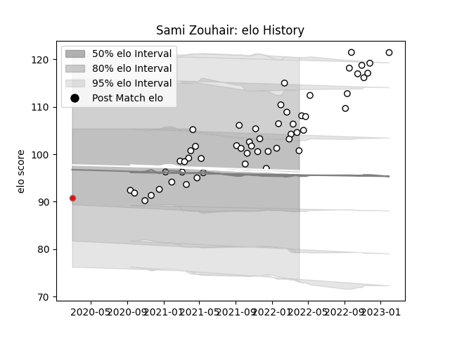

---  
layout: page  
title: Sami Zouhair  
date: 2023-02-02 18:39:55.026067  
categories: player  
---
# Sami Zouhair

## Positions: P

## Current elo: 101.0

## Current Percentile: 82.0

# Elo History

# Match History

| Team                       |   Appearances |   Win Rate |
|:---------------------------|--------------:|-----------:|
| Valence Romans Drome Rugby |            54 |   0.574074 |
| Roval Drome XV             |             1 |   0        |

| Opponent                   |   Matches |   Win Rate |
|:---------------------------|----------:|-----------:|
| Albi                       |         3 |   0.333333 |
| Cognac Saint Jean d'Angély |         3 |   1        |
| Tarbes                     |         3 |   0.666667 |
| Suresnes                   |         3 |   1        |
| Soyaux-Angouleme           |         3 |   0.5      |
| Nice                       |         3 |   1        |
| Dax                        |         3 |   0.333333 |
| Vannes                     |         3 |   0.333333 |
| Blagnac                    |         3 |   0.666667 |
| Chambery                   |         2 |   1        |
| Nevers                     |         2 |   0.5      |
| Aurillac                   |         2 |   0.5      |
| Biarritz Olympique         |         2 |   0.5      |
| Carqueiranne-Hyères        |         2 |   1        |
| Bourgoin-Jallieu           |         2 |   0.5      |
| Aubenas                    |         2 |   1        |
| Dijon                      |         2 |   0.5      |
| Massy                      |         2 |   0        |
| Mont-de-Marsan             |         1 |   0.5      |
| Montauban                  |         1 |   0        |
| Grenoble                   |         1 |   0        |
| Oyonnax                    |         1 |   0        |
| Perpignan                  |         1 |   0        |
| Provence Rugby             |         1 |   0        |
| Rennes                     |         1 |   1        |
| Rouen                      |         1 |   0        |
| Carcassonne                |         1 |   1        |
| Colomiers                  |         1 |   0        |