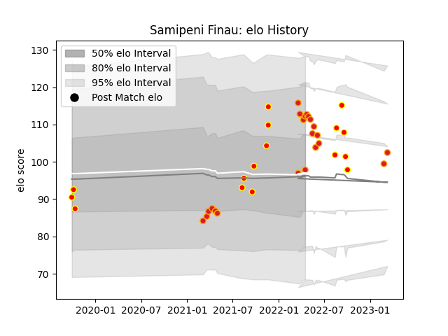

---  
layout: page  
title: Samipeni Finau  
date: 2023-02-24 09:53:20.616611  
categories: player  
---
# Samipeni Finau

## Positions: FL, L

## Current elo: 98.0

## Current Percentile: 84.0

# Elo History

# Match History

| Team    |   Appearances |   Win Rate |
|:--------|--------------:|-----------:|
| Chiefs  |            20 |     0.7    |
| Waikato |            16 |     0.6875 |

| Opponent                 |   Matches |   Win Rate |
|:-------------------------|----------:|-----------:|
| Moana Pasifika           |         4 |   1        |
| Blues                    |         3 |   0.333333 |
| Wellington               |         3 |   0.333333 |
| Tasman                   |         3 |   1        |
| Canterbury               |         2 |   0.5      |
| Crusaders                |         2 |   0        |
| Highlanders              |         2 |   0.5      |
| Hurricanes               |         2 |   1        |
| New South Wales Waratahs |         2 |   1        |
| Otago                    |         2 |   0        |
| Auckland                 |         1 |   1        |
| Northland                |         1 |   1        |
| Taranaki                 |         1 |   1        |
| Queensland Reds          |         1 |   1        |
| Melbourne Rebels         |         1 |   1        |
| North Harbour            |         1 |   1        |
| Bay of Plenty            |         1 |   1        |
| Fijian Drua              |         1 |   1        |
| Counties Manukau         |         1 |   1        |
| Brumbies                 |         1 |   0        |
| Western Force            |         1 |   1        |