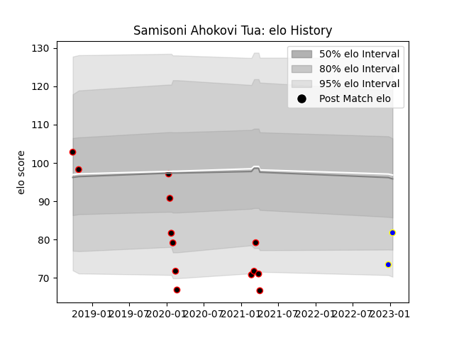

---  
layout: page  
title: Samisoni Ahokovi Tua  
date: 2023-01-17 11:32:50.872115  
categories: player  
---
# Samisoni Ahokovi Tua

## Positions: C

## Current elo: 82.0

## Current Percentile: 7.0

# Elo History

# Match History

| Team                            |   Appearances |   Win Rate |
|:--------------------------------|--------------:|-----------:|
| NTT Docomo Red Hurricanes Osaka |            13 |   0.461538 |
| Urayasu D-Rocks                 |             2 |   1        |

| Opponent                         |   Matches |   Win Rate |
|:---------------------------------|----------:|-----------:|
| Saitama Wild Knights             |         2 |          0 |
| Shizuoka Blue Revs               |         2 |          0 |
| Black Rams Tokyo                 |         1 |          1 |
| Chugoku Red Regulions            |         1 |          1 |
| Hino Red Dolphins                |         1 |          1 |
| Kobelco Kobe Steelers            |         1 |          0 |
| Mazda Blue Zoomers               |         1 |          1 |
| Mitsubishi Dynaboars             |         1 |          1 |
| Munakata Sanix Blues             |         1 |          0 |
| Shimizu Blue Sharks              |         1 |          1 |
| Toshiba Brave Lupus Tokyo        |         1 |          0 |
| Toyota Industries Shuttles Aichi |         1 |          1 |
| Yokohama Canon Eagles            |         1 |          1 |