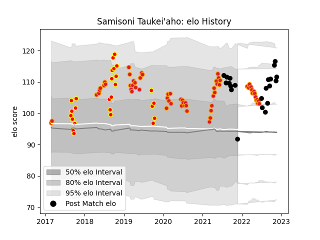

---  
layout: page  
title: Samisoni Taukei'aho  
date: 2023-02-24 09:46:27.205422  
categories: player  
---
# Samisoni Taukei'aho

## Positions: H

## Country: New Zealand

## Current elo: 92.0

## Current Percentile: 84.0

# Elo History

# Match History

| Team        |   Appearances |   Win Rate |
|:------------|--------------:|-----------:|
| Chiefs      |            63 |   0.579365 |
| Waikato     |            26 |   0.423077 |
| New Zealand |            21 |   0.785714 |

| Opponent                 |   Matches |   Win Rate |
|:-------------------------|----------:|-----------:|
| Crusaders                |        11 |   0.363636 |
| Blues                    |         8 |   0.5      |
| Hurricanes               |         8 |   0.5625   |
| Highlanders              |         8 |   0.5      |
| Australia                |         5 |   1        |
| New South Wales Waratahs |         5 |   1        |
| Brumbies                 |         5 |   0.4      |
| Argentina                |         4 |   0.75     |
| Queensland Reds          |         4 |   0.75     |
| Northland                |         3 |   0.666667 |
| Otago                    |         3 |   0.333333 |
| Melbourne Rebels         |         3 |   1        |
| South Africa             |         3 |   0.666667 |
| Wellington               |         3 |   0.333333 |
| Manawatu                 |         2 |   0        |
| Taranaki                 |         2 |   1        |
| Tasman                   |         2 |   0        |
| Wales                    |         2 |   1        |
| North Harbour            |         2 |   0        |
| Sunwolves                |         2 |   0.5      |
| Western Force            |         2 |   1        |
| Jaguares                 |         2 |   0.5      |
| Ireland                  |         2 |   0.5      |
| Hawke's Bay              |         2 |   0.5      |
| Bay of Plenty            |         2 |   0.5      |
| Auckland                 |         2 |   0.5      |
| Lions                    |         1 |   0        |
| Stormers                 |         1 |   1        |
| Bulls                    |         1 |   1        |
| Canterbury               |         1 |   0        |
| Counties Manukau         |         1 |   1        |
| England                  |         1 |   0.5      |
| Fiji                     |         1 |   1        |
| Southland                |         1 |   1        |
| Sharks                   |         1 |   0        |
| Scotland                 |         1 |   1        |
| Fijian Drua              |         1 |   1        |
| France                   |         1 |   0        |
| Japan                    |         1 |   1        |