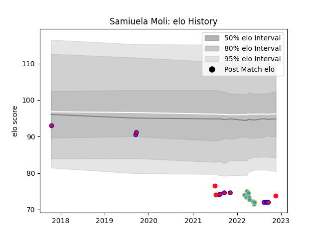

---  
layout: page  
title: Samiuela Moli  
date: 2022-11-16 11:40:48.995356  
categories: player  
---
# Samiuela Moli

## Positions: H

## Country: Tonga

## Current elo: 78.0

## Current Percentile: 2.0

# Elo History

# Match History

| Team           |   Appearances |   Win Rate |
|:---------------|--------------:|-----------:|
| Tasman         |            11 |   0.636364 |
| Moana Pasifika |            10 |   0.2      |
| Tonga          |             4 |   0.5      |

| Opponent         |   Matches |   Win Rate |
|:-----------------|----------:|-----------:|
| Auckland         |         2 |        0.5 |
| Chiefs           |         2 |        0   |
| Wellington       |         2 |        0.5 |
| Hurricanes       |         2 |        0.5 |
| Brumbies         |         1 |        1   |
| North Harbour    |         1 |        1   |
| Blues            |         1 |        0   |
| Waikato          |         1 |        1   |
| Spain            |         1 |        1   |
| Samoa            |         1 |        0   |
| Otago            |         1 |        0   |
| Northland        |         1 |        1   |
| New Zealand      |         1 |        0   |
| Chile            |         1 |        1   |
| Manawatu         |         1 |        1   |
| Bay of Plenty    |         1 |        1   |
| Highlanders      |         1 |        0   |
| Fijian Drua      |         1 |        0   |
| Crusaders        |         1 |        0   |
| Counties Manukau |         1 |        0   |
| Western Force    |         1 |        0   |