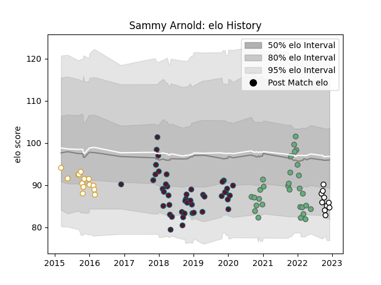

---  
layout: page  
title: Sammy Arnold  
date: 2022-12-12 15:25:08.761476  
categories: player  
---
# Sammy Arnold

## Positions: C

## Current elo: 85.0

## Current Percentile: 14.0

# Elo History

# Match History

| Team     |   Appearances |   Win Rate |
|:---------|--------------:|-----------:|
| Munster  |            45 |   0.688889 |
| Connacht |            30 |   0.466667 |
| Ulster   |            14 |   0.428571 |
| Brive    |            10 |   0.2      |

| Opponent             |   Matches |   Win Rate |
|:---------------------|----------:|-----------:|
| Ulster               |         8 |   0.3125   |
| Leinster             |         7 |   0.142857 |
| Edinburgh            |         7 |   0.428571 |
| Cardiff Blues        |         7 |   0.428571 |
| Ospreys              |         7 |   1        |
| Glasgow Warriors     |         7 |   0.571429 |
| Munster              |         6 |   0.166667 |
| Scarlets             |         5 |   0.4      |
| Benetton Treviso     |         5 |   1        |
| Zebre                |         5 |   1        |
| Leicester Tigers     |         4 |   0.5      |
| Connacht             |         4 |   1        |
| Dragons              |         4 |   0.5      |
| Castres Olympique    |         3 |   0.333333 |
| Stade Francais Paris |         3 |   0.333333 |
| Toulon               |         2 |   0.5      |
| Cheetahs             |         2 |   1        |
| Exeter Chiefs        |         1 |   0.5      |
| Bulls                |         1 |   1        |
| Bordeaux Begles      |         1 |   0        |
| Stormers             |         1 |   1        |
| Stade Toulousain     |         1 |   0        |
| Perpignan            |         1 |   1        |
| Saracens             |         1 |   1        |
| Racing 92            |         1 |   0        |
| Pau                  |         1 |   0        |
| Montpellier Herault  |         1 |   0        |
| La Rochelle          |         1 |   0        |
| Gloucester Rugby     |         1 |   1        |
| Bayonne              |         1 |   1        |