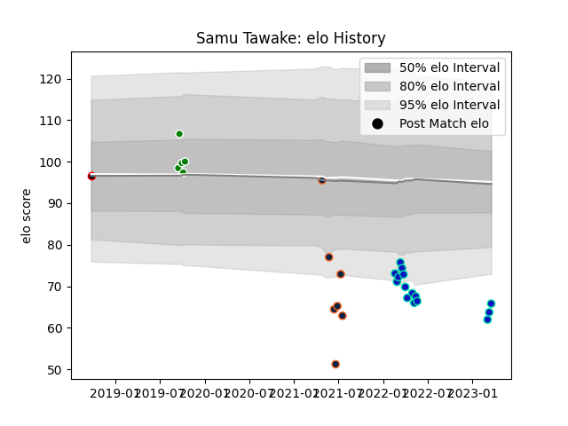

---  
layout: page  
title: Samu Tawake  
date: 2023-03-07 16:19:30.902839  
categories: player  
---
# Samu Tawake

## Positions: P

## Current elo: 88.0

## Current Percentile: 2.0

# Elo History

# Match History

| Team           |   Appearances |   Win Rate |
|:---------------|--------------:|-----------:|
| Fijian Drua    |            14 |   0.214286 |
| R.U. New York  |            10 |   0.4      |
| Rugby New York |             7 |   0.571429 |
| Manawatu       |             5 |   0.6      |
| Canterbury     |             1 |   1        |

| Opponent                 |   Matches |   Win Rate |
|:-------------------------|----------:|-----------:|
| NOLA Gold                |         3 |   0        |
| Toronto Arrows           |         3 |   0.333333 |
| Rugby ATL                |         3 |   0.666667 |
| New England Free Jacks   |         3 |   0.666667 |
| New South Wales Waratahs |         3 |   0        |
| Utah Warriors            |         2 |   0        |
| Houston SaberCats        |         2 |   1        |
| Melbourne Rebels         |         2 |   0.5      |
| Moana Pasifika           |         2 |   1        |
| Brumbies                 |         2 |   0        |
| North Harbour            |         1 |   0        |
| Southland                |         1 |   1        |
| Queensland Reds          |         1 |   0        |
| Otago                    |         1 |   1        |
| Bay of Plenty            |         1 |   0        |
| L. A. Giltinis           |         1 |   1        |
| Hurricanes               |         1 |   0        |
| Highlanders              |         1 |   0        |
| Crusaders                |         1 |   0        |
| Counties Manukau         |         1 |   1        |
| Canterbury               |         1 |   1        |
| Western Force            |         1 |   0        |