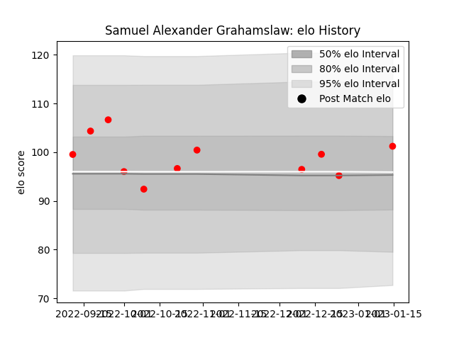

---  
layout: page  
title: Samuel Alexander Grahamslaw  
date: 2023-01-21 15:39:54.107619  
categories: player  
---
# Samuel Alexander Grahamslaw

## Positions: P

## Current elo: 101.0

## Current Percentile: 49.0

# Elo History

# Match History

| Team   |   Appearances |   Win Rate |
|:-------|--------------:|-----------:|
| Jersey |            11 |   0.863636 |

| Opponent            |   Matches |   Win Rate |
|:--------------------|----------:|-----------:|
| Coventry            |         2 |       0.75 |
| Ampthill            |         1 |       1    |
| Bedford             |         1 |       1    |
| Caldy               |         1 |       1    |
| Cornish Pirates     |         1 |       1    |
| Doncaster           |         1 |       1    |
| Ealing Trailfinders |         1 |       0    |
| Hartpury College    |         1 |       1    |
| London Scottish     |         1 |       1    |
| Nottingham          |         1 |       1    |