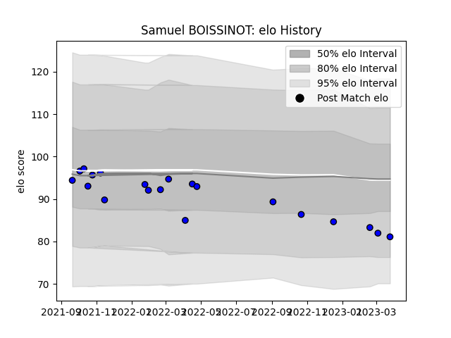

---  
layout: page  
title: Samuel BOISSINOT  
date: 2023-03-29 11:29:34.507114  
categories: player  
---
# Samuel BOISSINOT

Last updated: 2023-03-29
## Positions: SH

## Current elo: 81.0

## Current Percentile: 21.0

# Elo History

# Match History

| Team   |   Appearances |   Win Rate |
|:-------|--------------:|-----------:|
| Massy  |            20 |       0.65 |

| Opponent                   |   Matches |   Win Rate |
|:---------------------------|----------:|-----------:|
| Aubenas                    |         2 |        1   |
| Bourgoin-Jallieu           |         2 |        1   |
| Soyaux-Angouleme           |         2 |        0.5 |
| Tarbes                     |         2 |        1   |
| Aurillac                   |         1 |        0   |
| Biarritz Olympique         |         1 |        0   |
| Chambery                   |         1 |        1   |
| Cognac Saint Jean d'Angély |         1 |        1   |
| Dax                        |         1 |        1   |
| Dijon                      |         1 |        1   |
| Grenoble                   |         1 |        0   |
| Nevers                     |         1 |        0   |
| Nice                       |         1 |        1   |
| Oyonnax                    |         1 |        0   |
| Suresnes                   |         1 |        1   |
| Vannes                     |         1 |        0   |