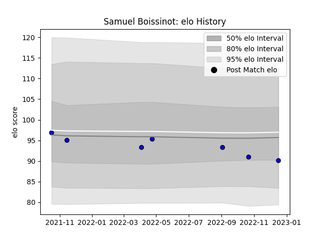

---  
layout: page  
title: Samuel Boissinot  
date: 2022-12-18 16:36:23.447338  
categories: player  
---
# Samuel Boissinot

## Positions: SH

## Current elo: 90.0

## Current Percentile: 27.0

# Elo History

# Match History

| Team   |   Appearances |   Win Rate |
|:-------|--------------:|-----------:|
| Massy  |             7 |   0.571429 |

| Opponent                   |   Matches |   Win Rate |
|:---------------------------|----------:|-----------:|
| Cognac Saint Jean d'Angély |         1 |          1 |
| Dax                        |         1 |          1 |
| Dijon                      |         1 |          1 |
| Grenoble                   |         1 |          0 |
| Oyonnax                    |         1 |          0 |
| Suresnes                   |         1 |          1 |
| Vannes                     |         1 |          0 |