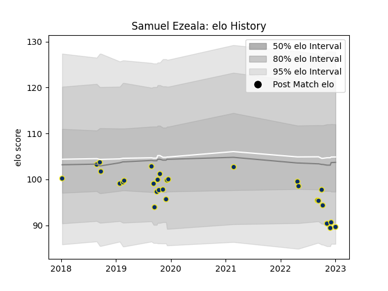

---  
layout: page  
title: Samuel Ezeala  
date: 2022-12-12 15:00:20.023222  
categories: player  
---
# Samuel Ezeala

## Positions: W, C

## Current elo: 79.0

## Current Percentile: 5.0

# Elo History

# Match History

| Team              |   Appearances |   Win Rate |
|:------------------|--------------:|-----------:|
| Clermont Auvergne |            28 |   0.535714 |

| Opponent             |   Matches |   Win Rate |
|:---------------------|----------:|-----------:|
| Bordeaux Begles      |         3 |   0.333333 |
| Lyon                 |         3 |   0.666667 |
| Pau                  |         3 |   0.666667 |
| Stade Francais Paris |         3 |   0.666667 |
| Agen                 |         2 |   1        |
| Bath Rugby           |         2 |   1        |
| Bayonne              |         2 |   0.5      |
| Castres Olympique    |         2 |   0        |
| Montpellier Herault  |         2 |   1        |
| Racing 92            |         2 |   0        |
| Stade Toulousain     |         2 |   0        |
| Brive                |         1 |   0        |
| La Rochelle          |         1 |   1        |