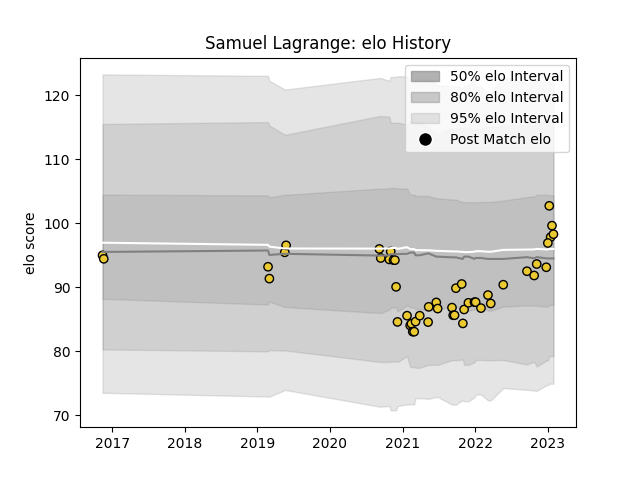

---  
layout: page  
title: Samuel Lagrange  
date: 2022-12-28 12:54:55.953956  
categories: player  
---
# Samuel Lagrange

## Positions: H

## Current elo: 103.0

## Current Percentile: 79.0

# Elo History

# Match History

| Team        |   Appearances |   Win Rate |
|:------------|--------------:|-----------:|
| La Rochelle |            43 |   0.488372 |

| Opponent             |   Matches |   Win Rate |
|:---------------------|----------:|-----------:|
| Bordeaux Begles      |         6 |   0.666667 |
| Stade Toulousain     |         6 |   0.166667 |
| Racing 92            |         5 |   0.4      |
| Brive                |         4 |   0.75     |
| Stade Francais Paris |         4 |   0.5      |
| Toulon               |         4 |   0.75     |
| Lyon                 |         3 |   0.333333 |
| Castres Olympique    |         2 |   0        |
| Montpellier Herault  |         2 |   0        |
| Pau                  |         2 |   1        |
| Perpignan            |         2 |   0.5      |
| Bayonne              |         1 |   1        |
| Biarritz Olympique   |         1 |   1        |
| Clermont Auvergne    |         1 |   0        |