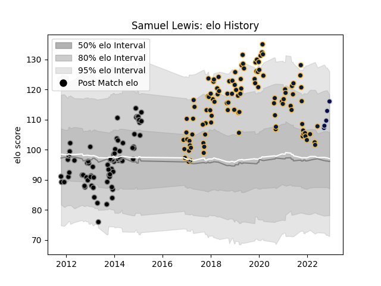

---  
layout: page  
title: Samuel Lewis  
date: 2023-02-02 18:52:48.971707  
categories: player  
---
# Samuel Lewis

## Positions: FL

## Current elo: 116.0

## Current Percentile: 84.0

# Elo History

# Match History

| Team               |   Appearances |   Win Rate |
|:-------------------|--------------:|-----------:|
| Worcester Warriors |           104 |   0.326923 |
| Ospreys            |            72 |   0.5      |
| Bristol Rugby      |             5 |   0.5      |

| Opponent             |   Matches |   Win Rate |
|:---------------------|----------:|-----------:|
| Northampton Saints   |        15 |  0.0666667 |
| Wasps                |        12 |  0.166667  |
| Exeter Chiefs        |        12 |  0.166667  |
| Bath Rugby           |        10 |  0.5       |
| Harlequins           |        10 |  0.5       |
| Sale Sharks          |         9 |  0.333333  |
| Leicester Tigers     |         9 |  0.444444  |
| Gloucester Rugby     |         9 |  0.333333  |
| Benetton Treviso     |         7 |  0.571429  |
| Saracens             |         7 |  0.285714  |
| Newcastle Falcons    |         7 |  0.214286  |
| Dragons              |         6 |  0.833333  |
| Edinburgh            |         6 |  0.5       |
| Ulster               |         6 |  0.333333  |
| Cardiff Blues        |         6 |  0.833333  |
| Bristol Rugby        |         6 |  0.5       |
| Leinster             |         5 |  0.3       |
| Zebre                |         5 |  0.8       |
| London Irish         |         5 |  0.8       |
| Glasgow Warriors     |         5 |  0         |
| Munster              |         4 |  0.375     |
| Connacht             |         4 |  0.625     |
| Scarlets             |         4 |  0.75      |
| Castres Olympique    |         3 |  0.333333  |
| Racing 92            |         2 |  0.25      |
| Aironi               |         2 |  1         |
| Pau                  |         1 |  0         |
| Stade Francais Paris |         1 |  1         |
| Stade Toulousain     |         1 |  0         |
| Brive                |         1 |  1         |
| Worcester Warriors   |         1 |  0         |