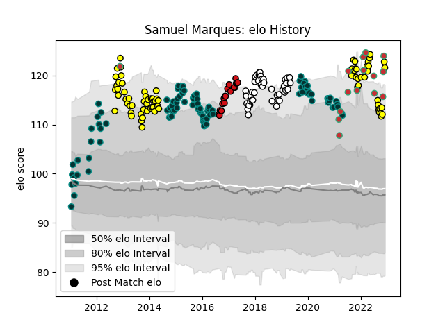

---  
layout: page  
title: Samuel Marques  
date: 2022-12-14 11:22:50.565781  
categories: player  
---
# Samuel Marques

## Positions: SH

## Country: Portugal

## Current elo: 123.0

## Current Percentile: 96.0

# Elo History

# Match History

| Team             |   Appearances |   Win Rate |
|:-----------------|--------------:|-----------:|
| Pau              |            93 |   0.532258 |
| Albi             |            44 |   0.477273 |
| Brive            |            43 |   0.476744 |
| Carcassonne      |            32 |   0.546875 |
| Stade Toulousain |            18 |   0.5      |
| Portugal         |            15 |   0.466667 |

| Opponent                 |   Matches |   Win Rate |
|:-------------------------|----------:|-----------:|
| Agen                     |         9 |   0.777778 |
| Stade Francais Paris     |         9 |   0.555556 |
| Colomiers                |         9 |   0.722222 |
| Castres Olympique        |         9 |   0.444444 |
| Narbonne                 |         8 |   0.75     |
| Oyonnax                  |         8 |   0.625    |
| Pau                      |         8 |   0.125    |
| Racing 92                |         8 |   0.0625   |
| Lyon                     |         8 |   0.4375   |
| Bordeaux Begles          |         8 |   0.4375   |
| Beziers                  |         8 |   0.75     |
| Bayonne                  |         8 |   0.625    |
| Aurillac                 |         8 |   0.75     |
| Tarbes                   |         8 |   0.3125   |
| La Rochelle              |         7 |   0.142857 |
| Provence Rugby           |         7 |   0.428571 |
| Stade Toulousain         |         6 |   0.166667 |
| Toulon                   |         6 |   0.166667 |
| Dax                      |         6 |   0.666667 |
| Montpellier Herault      |         6 |   0.833333 |
| Montauban                |         6 |   0.666667 |
| Grenoble                 |         6 |   0.5      |
| Mont-de-Marsan           |         6 |   0.333333 |
| Massy                    |         5 |   0.8      |
| Brive                    |         5 |   0        |
| Auch                     |         5 |   0.7      |
| Clermont Auvergne        |         5 |   0.2      |
| Vannes                   |         4 |   0.625    |
| US Bressane              |         4 |   0.75     |
| Nevers                   |         4 |   0.75     |
| Carcassonne              |         4 |   0.25     |
| Bourgoin-Jallieu         |         4 |   1        |
| Biarritz Olympique       |         3 |   0.666667 |
| Georgia                  |         2 |   0.25     |
| Sale Sharks              |         2 |   0        |
| Perpignan                |         2 |   0.5      |
| Spain                    |         2 |   0.5      |
| Romania                  |         2 |   0        |
| Soyaux-Angouleme         |         2 |   0.5      |
| Uruguay                  |         1 |   1        |
| United States of America |         1 |   0.5      |
| Argentina                |         1 |   0        |
| Worcester Warriors       |         1 |   1        |
| Kenya                    |         1 |   1        |
| Russia                   |         1 |   1        |
| Rouen                    |         1 |   1        |
| Japan                    |         1 |   0        |
| Calvisano                |         1 |   1        |
| Cardiff Blues            |         1 |   0        |
| Netherlands              |         1 |   1        |
| Munster                  |         1 |   0        |
| Dragons                  |         1 |   0        |
| Hong Kong                |         1 |   1        |
| Albi                     |         1 |   1        |
| Italy                    |         1 |   0        |
| Leicester Tigers         |         1 |   1        |
| Zebre                    |         1 |   1        |