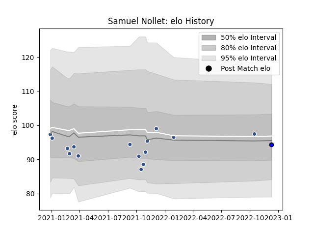

---  
layout: page  
title: Samuel Nollet  
date: 2023-01-13 11:33:43.870103  
categories: player  
---
# Samuel Nollet

## Positions: N8, FL

## Current elo: 90.0

## Current Percentile: 61.0

# Elo History

# Match History

| Team   |   Appearances |   Win Rate |
|:-------|--------------:|-----------:|
| Agen   |            21 |   0.238095 |
| Massy  |             3 |   0.333333 |

| Opponent            |   Matches |   Win Rate |
|:--------------------|----------:|-----------:|
| Vannes              |         2 |        0.5 |
| Beziers             |         2 |        0   |
| Carcassonne         |         2 |        0.5 |
| Colomiers           |         2 |        0.5 |
| Grenoble            |         2 |        0   |
| Oyonnax             |         2 |        0   |
| Montpellier Herault |         1 |        0   |
| US Bressane         |         1 |        0   |
| Racing 92           |         1 |        0   |
| Provence Rugby      |         1 |        0   |
| Narbonne            |         1 |        0   |
| Aurillac            |         1 |        1   |
| Montauban           |         1 |        1   |
| Bayonne             |         1 |        0   |
| Clermont Auvergne   |         1 |        0   |
| Brive               |         1 |        0   |
| Biarritz Olympique  |         1 |        1   |
| La Rochelle         |         1 |        0   |