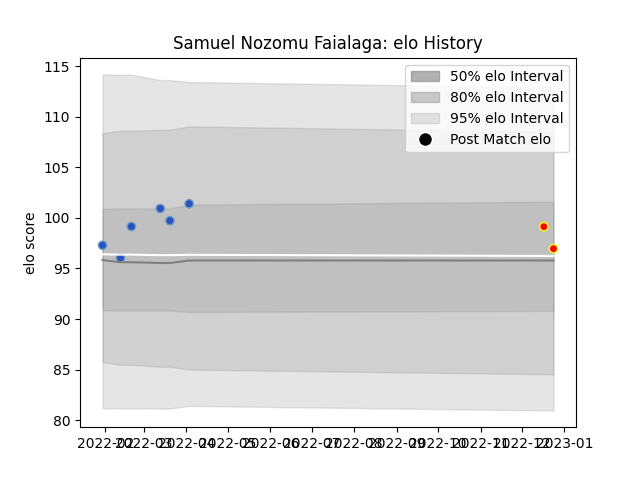

---  
layout: page  
title: Samuel Nozomu Faialaga  
date: 2023-03-21 18:26:10.509480  
categories: player  
---
# Samuel Nozomu Faialaga

Last updated: 2023-03-21
## Positions: P

## Current elo: 97.0

## Current Percentile: 69.0

# Elo History

# Match History

| Team                 |   Appearances |   Win Rate |
|:---------------------|--------------:|-----------:|
| Kyuden Voltex        |             8 |   0.875    |
| Munakata Sanix Blues |             6 |   0.833333 |

| Opponent                        |   Matches |   Win Rate |
|:--------------------------------|----------:|-----------:|
| Kurita Water Gush               |         5 |        1   |
| Chugoku Red Regulions           |         2 |        1   |
| Kyuden Voltex                   |         2 |        1   |
| Shimizu Blue Sharks             |         2 |        0.5 |
| Skyactivs Hiroshima             |         2 |        1   |
| NTT Docomo Red Hurricanes Osaka |         1 |        0   |