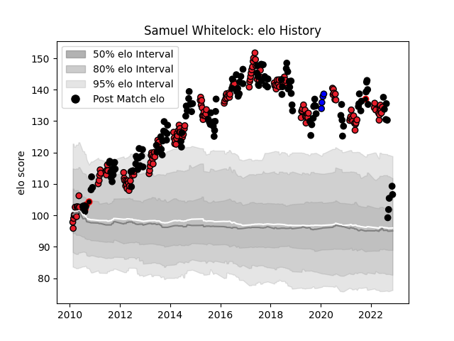

---  
layout: page  
title: Samuel Whitelock  
date: 2022-11-15 23:37:58.087090  
categories: player  
---
# Samuel Whitelock

## Positions: L

## Country: New Zealand

## Current elo: 107.0

## Current Percentile: 98.0

# Elo History

# Match History

| Team                 |   Appearances |   Win Rate |
|:---------------------|--------------:|-----------:|
| Crusaders            |           174 |   0.747126 |
| New Zealand          |           136 |   0.849265 |
| Canterbury           |             4 |   0.75     |
| Saitama Wild Knights |             4 |   1        |

| Opponent                          |   Matches |   Win Rate |
|:----------------------------------|----------:|-----------:|
| Australia                         |        36 |   0.819444 |
| South Africa                      |        22 |   0.795455 |
| Chiefs                            |        21 |   0.52381  |
| Highlanders                       |        21 |   0.809524 |
| Hurricanes                        |        19 |   0.552632 |
| Blues                             |        18 |   0.833333 |
| Argentina                         |        16 |   0.875    |
| France                            |        12 |   0.916667 |
| Queensland Reds                   |        11 |   0.818182 |
| Brumbies                          |        11 |   1        |
| New South Wales Waratahs          |        11 |   0.636364 |
| Ireland                           |        10 |   0.7      |
| Lions                             |        10 |   0.9      |
| England                           |         9 |   0.777778 |
| Sharks                            |         9 |   0.777778 |
| Melbourne Rebels                  |         9 |   0.888889 |
| Stormers                          |         8 |   0.8125   |
| Wales                             |         8 |   1        |
| Bulls                             |         7 |   0.428571 |
| Western Force                     |         7 |   0.714286 |
| Cheetahs                          |         5 |   1        |
| Tonga                             |         4 |   1        |
| Scotland                          |         4 |   1        |
| British and Irish Lions           |         4 |   0.375    |
| Southern Kings                    |         2 |   1        |
| Samoa                             |         2 |   1        |
| Canada                            |         2 |   1        |
| Jaguares                          |         2 |   1        |
| Fiji                              |         2 |   1        |
| Namibia                           |         2 |   1        |
| United States of America          |         1 |   1        |
| Sunwolves                         |         1 |   1        |
| Toyota Verblitz                   |         1 |   1        |
| Wellington                        |         1 |   0        |
| Toshiba Brave Lupus Tokyo         |         1 |   1        |
| Fijian Drua                       |         1 |   1        |
| Southland                         |         1 |   1        |
| Bay of Plenty                     |         1 |   1        |
| Georgia                           |         1 |   1        |
| North Harbour                     |         1 |   1        |
| Kubota Spears Funabashi Tokyo-Bay |         1 |   1        |
| Japan                             |         1 |   1        |
| Italy                             |         1 |   1        |
| Yokohama Canon Eagles             |         1 |   1        |