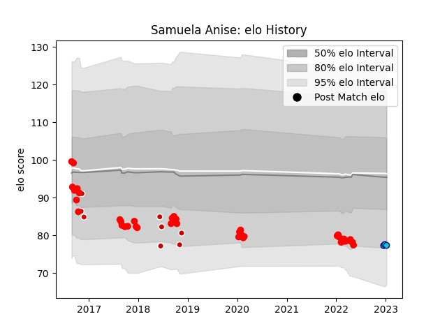

---  
layout: page  
title: Samuela Anise  
date: 2022-12-18 16:23:44.655165  
categories: player  
---
# Samuela Anise

## Positions: L

## Country: Japan

## Current elo: 80.0

## Current Percentile: 9.0

# Elo History

# Match History

| Team                  |   Appearances |   Win Rate |
|:----------------------|--------------:|-----------:|
| Yokohama Canon Eagles |            28 |   0.303571 |
| Japan                 |             8 |   0.375    |
| Shizuoka Blue Revs    |             1 |   0        |

| Opponent                          |   Matches |   Win Rate |
|:----------------------------------|----------:|-----------:|
| Saitama Wild Knights              |         4 |       0    |
| Shizuoka Blue Revs                |         3 |       0    |
| Mie Honda Heat                    |         2 |       0.25 |
| Kubota Spears Funabashi Tokyo-Bay |         2 |       0    |
| Toyota Industries Shuttles Aichi  |         2 |       1    |
| Toshiba Brave Lupus Tokyo         |         2 |       0.5  |
| Tokyo Sungoliath                  |         2 |       0    |
| Black Rams Tokyo                  |         2 |       0    |
| Toyota Verblitz                   |         2 |       0    |
| Kobelco Kobe Steelers             |         2 |       0    |
| Italy                             |         2 |       0.5  |
| Green Rockets Tokatsu             |         2 |       0.5  |
| Georgia                           |         2 |       1    |
| Coca-Cola Red Sparks              |         2 |       1    |
| Mitsubishi Dynaboars              |         1 |       1    |
| Munakata Sanix Blues              |         1 |       1    |
| New Zealand                       |         1 |       0    |
| Fiji                              |         1 |       0    |
| England                           |         1 |       0    |
| Argentina                         |         1 |       0    |