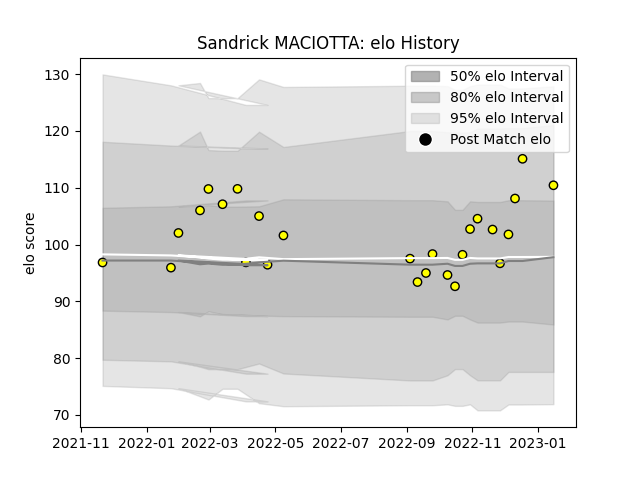

---  
layout: page  
title: Sandrick MACIOTTA  
date: 2023-03-30 11:33:01.552844  
categories: player  
---
# Sandrick MACIOTTA

Last updated: 2023-03-30
## Positions: N8, FL

## Current elo: 111.0

## Current Percentile: 87.0

# Elo History

# Match History

| Team   |   Appearances |   Win Rate |
|:-------|--------------:|-----------:|
| Albi   |            32 |     0.6875 |

| Opponent                   |   Matches |   Win Rate |
|:---------------------------|----------:|-----------:|
| Bourgoin-Jallieu           |         3 |   0.666667 |
| Dax                        |         3 |   1        |
| Nice                       |         3 |   0.333333 |
| Valence Romans Drome Rugby |         3 |   0.666667 |
| Aubenas                    |         2 |   1        |
| Blagnac                    |         2 |   0.5      |
| Carqueiranne-Hyères        |         2 |   0.5      |
| Chambery                   |         2 |   1        |
| Cognac Saint Jean d'Angély |         2 |   1        |
| Narbonne                   |         2 |   1        |
| Rennes                     |         2 |   1        |
| Suresnes                   |         2 |   0.5      |
| Tarbes                     |         2 |   0        |
| Soyaux-Angouleme           |         1 |   0        |
| US Bressane                |         1 |   1        |