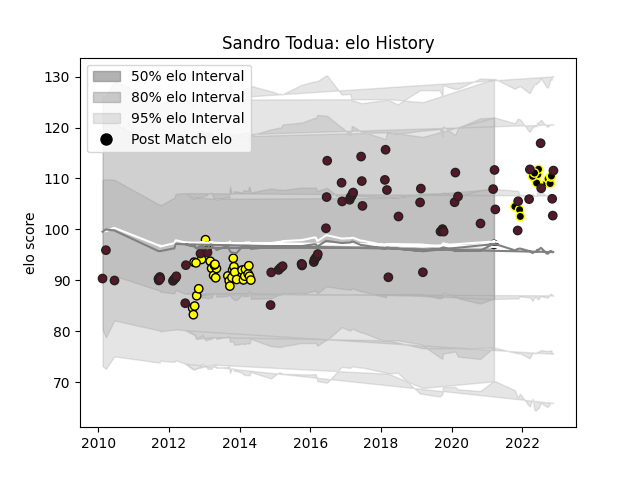

---  
layout: page  
title: Sandro Todua  
date: 2022-11-16 11:31:21.440824  
categories: player  
---
# Sandro Todua

## Positions: W

## Country: Georgia

## Current elo: 95.0

## Current Percentile: 87.0

# Elo History

# Match History

| Team       |   Appearances |   Win Rate |
|:-----------|--------------:|-----------:|
| Georgia    |            45 |   0.577778 |
| Albi       |            32 |   0.296875 |
| Black Lion |             3 |   0.666667 |

| Opponent                 |   Matches |   Win Rate |
|:-------------------------|----------:|-----------:|
| Romania                  |         5 |   1        |
| Tarbes                   |         4 |   0.25     |
| Spain                    |         4 |   1        |
| Scotland                 |         4 |   0        |
| Narbonne                 |         3 |   0.333333 |
| Auch                     |         3 |   0.5      |
| Lyon                     |         3 |   0        |
| Argentina                |         3 |   0        |
| Japan                    |         3 |   0.333333 |
| Samoa                    |         3 |   0.5      |
| Pau                      |         3 |   0        |
| Fiji                     |         3 |   0.5      |
| Portugal                 |         3 |   1        |
| La Rochelle              |         2 |   0.5      |
| Oyonnax                  |         2 |   0        |
| Uruguay                  |         2 |   1        |
| Dax                      |         2 |   0        |
| US Bressane              |         2 |   1        |
| United States of America |         2 |   0.5      |
| Aurillac                 |         2 |   0.5      |
| Russia                   |         1 |   1        |
| Namibia                  |         1 |   1        |
| Tonga                    |         1 |   1        |
| New Zealand              |         1 |   0        |
| SWD Eagles               |         1 |   1        |
| Agen                     |         1 |   0        |
| Mont-de-Marsan           |         1 |   0        |
| Massy                    |         1 |   1        |
| Italy A                  |         1 |   0        |
| Italy                    |         1 |   1        |
| Ireland                  |         1 |   0        |
| Germany                  |         1 |   1        |
| France                   |         1 |   0        |
| England                  |         1 |   0        |
| Carcassonne              |         1 |   0        |
| Canada                   |         1 |   1        |
| Brive                    |         1 |   0        |
| Boland Cavaliers         |         1 |   0        |
| Beziers                  |         1 |   1        |
| Belgium                  |         1 |   1        |
| Australia                |         1 |   0        |
| Leopards                 |         1 |   1        |