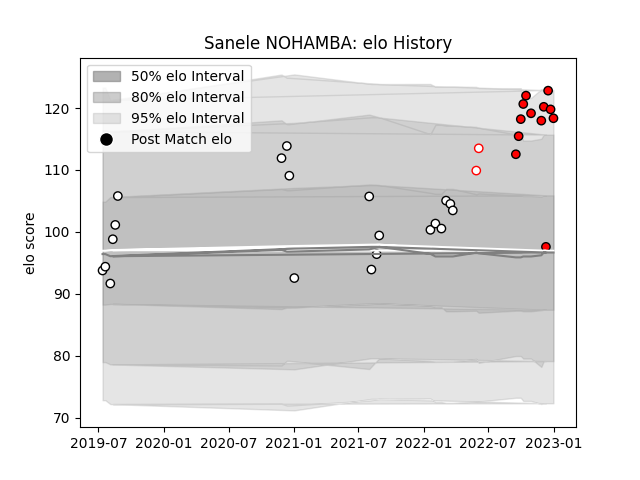

---  
layout: page  
title: Sanele NOHAMBA  
date: 2023-03-04 11:43:51.769092  
categories: player  
---
# Sanele NOHAMBA

## Positions: SH

## Current elo: 112.0

## Current Percentile: 86.0

# Elo History

# Match History

| Team         |   Appearances |   Win Rate |
|:-------------|--------------:|-----------:|
| Natal Sharks |            25 |   0.6      |
| Sharks       |            10 |   0.8      |
| Lions        |             7 |   0.571429 |
| Golden Lions |             2 |   1        |

| Opponent            |   Matches |   Win Rate |
|:--------------------|----------:|-----------:|
| Blue Bulls          |         6 |   0.5      |
| Griquas             |         5 |   0.6      |
| Western Province    |         5 |   0.8      |
| Golden Lions        |         4 |   0.75     |
| Free State Cheetahs |         3 |   0.333333 |
| Bulls               |         3 |   0.666667 |
| Pumas               |         3 |   0.666667 |
| Stormers            |         2 |   0.5      |
| Ospreys             |         2 |   1        |
| Dragons             |         1 |   1        |
| Natal Sharks        |         1 |   1        |
| Ulster              |         1 |   0        |
| Queensland Reds     |         1 |   1        |
| Melbourne Rebels    |         1 |   1        |
| Munster             |         1 |   0        |
| Edinburgh           |         1 |   1        |
| Hurricanes          |         1 |   0        |
| Highlanders         |         1 |   1        |
| Cardiff Blues       |         1 |   1        |
| Jaguares            |         1 |   1        |