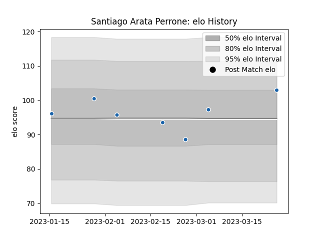

---  
layout: page  
title: Santiago ARATA PERRONE  
date: 2023-02-08 11:10:05.044099  
categories: player  
---
# Santiago ARATA PERRONE

## Positions: SH

## Country: Uruguay

## Current elo: 100.0

## Current Percentile: 62.0

# Elo History

# Match History

| Team              |   Appearances |   Win Rate |
|:------------------|--------------:|-----------:|
| Castres Olympique |            52 |   0.596154 |
| Uruguay           |            15 |   0.466667 |
| Houston SaberCats |             3 |   0.666667 |
| Penarol Rugby     |             1 |   0        |

| Opponent                 |   Matches |   Win Rate |
|:-------------------------|----------:|-----------:|
| Bordeaux Begles          |         5 |   0.3      |
| Clermont Auvergne        |         5 |   0.4      |
| Montpellier Herault      |         5 |   0.6      |
| Stade Toulousain         |         4 |   0.625    |
| Brive                    |         4 |   0.75     |
| Pau                      |         4 |   1        |
| Lyon                     |         3 |   1        |
| Racing 92                |         3 |   0.666667 |
| Toulon                   |         3 |   0.333333 |
| Stade Francais Paris     |         3 |   0.333333 |
| Perpignan                |         3 |   0.666667 |
| NOLA Gold                |         2 |   0.5      |
| Munster                  |         2 |   0        |
| La Rochelle              |         2 |   1        |
| Spain                    |         2 |   0        |
| Romania                  |         2 |   0.5      |
| Fiji                     |         2 |   0.5      |
| Bayonne                  |         2 |   1        |
| Namibia                  |         2 |   1        |
| Selknam                  |         1 |   0        |
| United States of America |         1 |   1        |
| Agen                     |         1 |   1        |
| Austin Elite Rugby       |         1 |   1        |
| Harlequins               |         1 |   0        |
| Germany                  |         1 |   0        |
| Georgia                  |         1 |   0        |
| Edinburgh                |         1 |   0        |
| Canada                   |         1 |   1        |
| Brazil                   |         1 |   1        |
| Biarritz Olympique       |         1 |   1        |
| Australia                |         1 |   0        |
| Wales                    |         1 |   0        |