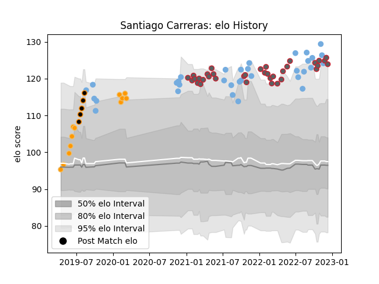

---  
layout: page  
title: Santiago Carreras  
date: 2022-11-15 23:41:04.121162  
categories: player  
---
# Santiago Carreras

## Positions: W, FB

## Country: Argentina

## Current elo: 126.0

## Current Percentile: 97.0

# Elo History

# Match History

| Team             |   Appearances |   Win Rate |
|:-----------------|--------------:|-----------:|
| Argentina        |            32 |   0.375    |
| Gloucester Rugby |            32 |   0.546875 |
| Jaguares         |            12 |   0.833333 |
| Jaguares XV      |             5 |   1        |

| Opponent                 |   Matches |   Win Rate |
|:-------------------------|----------:|-----------:|
| Australia                |         8 |   0.3125   |
| New Zealand              |         5 |   0.4      |
| South Africa             |         5 |   0        |
| London Irish             |         5 |   0.7      |
| Bristol Rugby            |         4 |   0.25     |
| Newcastle Falcons        |         4 |   0.75     |
| Exeter Chiefs            |         4 |   0.5      |
| Northampton Saints       |         3 |   0.666667 |
| Wales                    |         3 |   0.5      |
| Scotland                 |         3 |   0.666667 |
| Sharks                   |         3 |   0.666667 |
| Leicester Tigers         |         2 |   0        |
| Saracens                 |         2 |   1        |
| Bath Rugby               |         2 |   1        |
| Queensland Reds          |         2 |   1        |
| Sale Sharks              |         2 |   0        |
| France                   |         2 |   0        |
| England                  |         2 |   0.5      |
| Wasps                    |         2 |   0.5      |
| Boland Cavaliers         |         1 |   1        |
| Tonga                    |         1 |   1        |
| United States of America |         1 |   1        |
| Valke                    |         1 |   1        |
| Sunwolves                |         1 |   1        |
| Border Bulldogs          |         1 |   1        |
| SWD Eagles               |         1 |   1        |
| Brumbies                 |         1 |   1        |
| New South Wales Waratahs |         1 |   1        |
| Lions                    |         1 |   1        |
| Italy                    |         1 |   1        |
| Ireland                  |         1 |   0        |
| Hurricanes               |         1 |   0        |
| Harlequins               |         1 |   0        |
| Eastern Province Kings   |         1 |   1        |
| Chiefs                   |         1 |   1        |
| Bulls                    |         1 |   1        |
| Worcester Warriors       |         1 |   1        |