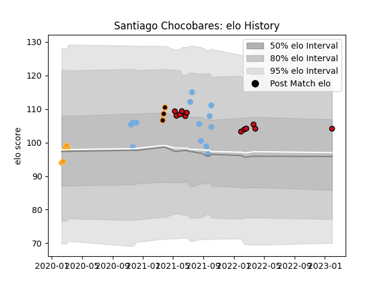

---  
layout: page  
title: Santiago Chocobares  
date: 2023-01-30 17:50:25.039697  
categories: player  
---
# Santiago Chocobares

## Positions: C

## Country: Argentina

## Current elo: 104.0

## Current Percentile: 68.0

# Elo History

# Match History

| Team             |   Appearances |   Win Rate |
|:-----------------|--------------:|-----------:|
| Argentina        |            13 |   0.307692 |
| Stade Toulousain |            12 |   0.583333 |
| Jaguares         |             5 |   0.4      |
| Jaguares XV      |             3 |   1        |

| Opponent             |   Matches |   Win Rate |
|:---------------------|----------:|-----------:|
| Australia            |         6 |   0.25     |
| New Zealand          |         3 |   0.333333 |
| Montpellier Herault  |         2 |   1        |
| South Africa         |         2 |   0        |
| Wales                |         2 |   0.75     |
| Bordeaux Begles      |         2 |   1        |
| Clermont Auvergne    |         1 |   1        |
| Racing 92            |         1 |   0        |
| Toulon               |         1 |   0        |
| Stormers             |         1 |   0        |
| Stade Francais Paris |         1 |   0        |
| Sharks               |         1 |   0        |
| Selknam              |         1 |   1        |
| Queensland Reds      |         1 |   1        |
| Hurricanes           |         1 |   0        |
| Pau                  |         1 |   0        |
| Bayonne              |         1 |   0        |
| Bulls                |         1 |   1        |
| Cafeteros Pro        |         1 |   1        |
| Lyon                 |         1 |   1        |
| La Rochelle          |         1 |   1        |
| Olimpia Lions        |         1 |   1        |