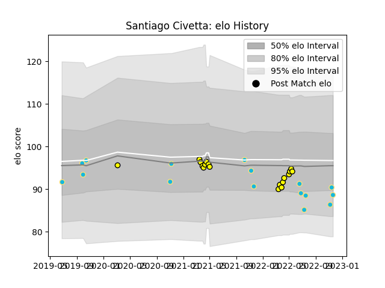

---  
layout: page  
title: Santiago Civetta  
date: 2022-11-22 11:26:29.772346  
categories: player  
---
# Santiago Civetta

## Positions: FL

## Country: Uruguay

## Current elo: 89.0

## Current Percentile: 27.0

# Elo History

# Match History

| Team          |   Appearances |   Win Rate |
|:--------------|--------------:|-----------:|
| Penarol Rugby |            18 |   0.666667 |
| Uruguay       |            16 |   0.3125   |

| Opponent                 |   Matches |   Win Rate |
|:-------------------------|----------:|-----------:|
| Selknam                  |         5 |   0.4      |
| Jaguares XV              |         4 |   0.5      |
| Olimpia Lions            |         4 |   0.75     |
| Romania                  |         4 |   0.5      |
| Cobras                   |         3 |   1        |
| Spain                    |         3 |   0.333333 |
| Cafeteros Pro            |         2 |   1        |
| Georgia                  |         2 |   0        |
| Japan                    |         2 |   0        |
| Fiji                     |         1 |   1        |
| Italy                    |         1 |   0        |
| Tonga                    |         1 |   0        |
| United States of America |         1 |   1        |
| Wales                    |         1 |   0        |