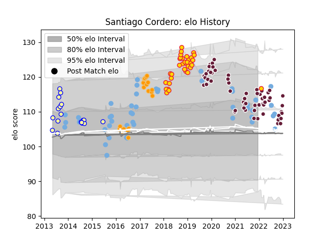

---  
layout: page  
title: Santiago Cordero  
date: 2023-02-02 18:39:27.710087  
categories: player  
---
# Santiago Cordero

## Positions: W, FB

## Country: Argentina

## Current elo: 105.0

## Current Percentile: 60.0

# Elo History

# Match History

| Team                |   Appearances |   Win Rate |
|:--------------------|--------------:|-----------:|
| Bordeaux Begles     |            61 |   0.614754 |
| Argentina           |            46 |   0.315217 |
| Exeter Chiefs       |            34 |   0.720588 |
| Jaguares            |            20 |   0.5      |
| Regatas Bella Vista |            20 |   0.45     |

| Opponent                 |   Matches |   Win Rate |
|:-------------------------|----------:|-----------:|
| New Zealand              |        12 |   0.166667 |
| Australia                |         9 |   0.111111 |
| Castres Olympique        |         7 |   0.714286 |
| Stade Toulousain         |         6 |   0.166667 |
| Gloucester Rugby         |         6 |   0.333333 |
| South Africa             |         5 |   0.2      |
| Clermont Auvergne        |         5 |   0.7      |
| Racing 92                |         5 |   0.8      |
| Wasps                    |         5 |   0.4      |
| Toulon                   |         4 |   0.5      |
| Pau                      |         4 |   0.5      |
| Montpellier Herault      |         4 |   0.625    |
| Scotland                 |         4 |   0.25     |
| Bath Rugby               |         4 |   1        |
| Lions                    |         3 |   0.666667 |
| Sale Sharks              |         3 |   1        |
| Leicester Tigers         |         3 |   0.666667 |
| La Rochelle              |         3 |   0.666667 |
| Newcastle Falcons        |         3 |   1        |
| Perpignan                |         3 |   0.333333 |
| Italy                    |         3 |   1        |
| Worcester Warriors       |         3 |   0.666667 |
| Sharks                   |         3 |   0        |
| Edinburgh                |         3 |   0.833333 |
| Southern Kings           |         3 |   0.666667 |
| Brive                    |         3 |   0.666667 |
| Bristol Rugby            |         3 |   0.666667 |
| Wales                    |         3 |   0.166667 |
| Alumni                   |         3 |   1        |
| San Luis                 |         2 |   0        |
| Saracens                 |         2 |   1        |
| Pueyrredón               |         2 |   1        |
| Stade Francais Paris     |         2 |   1        |
| Stormers                 |         2 |   0        |
| Munster                  |         2 |   0.25     |
| Agen                     |         2 |   1        |
| Manuel Belgrano          |         2 |   1        |
| Cheetahs                 |         2 |   1        |
| France                   |         2 |   0.5      |
| Hindu                    |         2 |   0        |
| England                  |         2 |   0        |
| Ireland                  |         2 |   0.5      |
| CASI                     |         2 |   0        |
| Bulls                    |         2 |   0.5      |
| Bayonne                  |         2 |   1        |
| Lyon                     |         2 |   1        |
| Sunwolves                |         1 |   1        |
| Georgia                  |         1 |   1        |
| CUBA                     |         1 |   0        |
| Tonga                    |         1 |   1        |
| Chiefs                   |         1 |   0        |
| Biarritz Olympique       |         1 |   1        |
| Western Force            |         1 |   0        |
| Melbourne Rebels         |         1 |   1        |
| Scarlets                 |         1 |   1        |
| Highlanders              |         1 |   0        |
| SIC                      |         1 |   0        |
| Romania                  |         1 |   1        |
| Japan                    |         1 |   1        |
| Pucara                   |         1 |   0        |
| La Plata                 |         1 |   0        |
| Liceo Naval              |         1 |   1        |
| Northampton Saints       |         1 |   0        |
| Newman                   |         1 |   0        |
| Lomas                    |         1 |   1        |
| London Irish             |         1 |   1        |
| New South Wales Waratahs |         1 |   1        |
| Harlequins               |         1 |   1        |