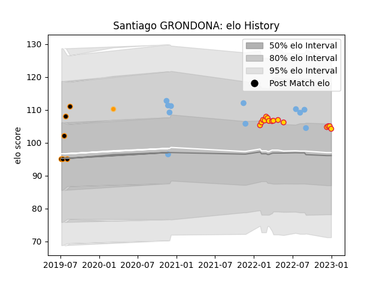

---  
layout: page  
title: Santiago GRONDONA  
date: 2023-03-29 11:31:47.587976  
categories: player  
---
# Santiago GRONDONA

Last updated: 2023-03-29
## Positions: FL, N8

## Country: Argentina

## Current elo: 100.0

## Current Percentile: 61.0

# Elo History

# Match History

| Team          |   Appearances |   Win Rate |
|:--------------|--------------:|-----------:|
| Exeter Chiefs |            13 |   0.538462 |
| Argentina     |            11 |   0.5      |
| Jaguares XV   |             7 |   1        |
| Jaguares      |             1 |   0        |

| Opponent               |   Matches |   Win Rate |
|:-----------------------|----------:|-----------:|
| Australia              |         4 |      0.375 |
| New Zealand            |         4 |      0.5   |
| Griffons               |         2 |      1     |
| Leopards               |         1 |      1     |
| Wasps                  |         1 |      0     |
| Sharks                 |         1 |      0     |
| Scotland               |         1 |      1     |
| Saracens               |         1 |      0     |
| Sale Sharks            |         1 |      1     |
| SWD Eagles             |         1 |      1     |
| Northampton Saints     |         1 |      1     |
| Newcastle Falcons      |         1 |      1     |
| London Irish           |         1 |      0     |
| Leicester Tigers       |         1 |      0     |
| Bath Rugby             |         1 |      1     |
| Italy                  |         1 |      1     |
| Ireland                |         1 |      0     |
| Gloucester Rugby       |         1 |      1     |
| Eastern Province Kings |         1 |      1     |
| Castres Olympique      |         1 |      1     |
| Bulls                  |         1 |      1     |
| Bristol Rugby          |         1 |      0     |
| Border Bulldogs        |         1 |      1     |
| Boland Cavaliers       |         1 |      1     |
| Worcester Warriors     |         1 |      0     |