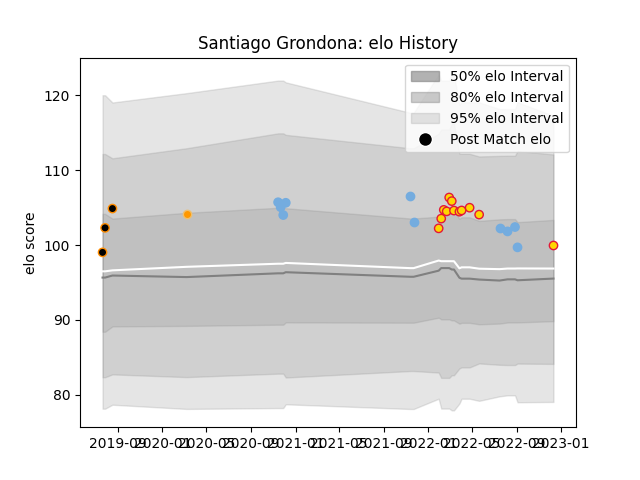

---  
layout: page  
title: Santiago Grondona  
date: 2022-12-14 11:35:59.124633  
categories: player  
---
# Santiago Grondona

## Positions: FL, N8

## Country: Argentina

## Current elo: 100.0

## Current Percentile: 65.0

# Elo History

# Match History

| Team          |   Appearances |   Win Rate |
|:--------------|--------------:|-----------:|
| Exeter Chiefs |            12 |        0.5 |
| Argentina     |            10 |        0.5 |
| Jaguares XV   |             3 |        1   |
| Jaguares      |             1 |        0   |

| Opponent               |   Matches |   Win Rate |
|:-----------------------|----------:|-----------:|
| New Zealand            |         4 |   0.5      |
| Australia              |         3 |   0.333333 |
| London Irish           |         1 |   0        |
| Wasps                  |         1 |   0        |
| Sharks                 |         1 |   0        |
| Scotland               |         1 |   1        |
| Saracens               |         1 |   0        |
| Sale Sharks            |         1 |   1        |
| Northampton Saints     |         1 |   1        |
| Newcastle Falcons      |         1 |   1        |
| Leopards               |         1 |   1        |
| Bath Rugby             |         1 |   1        |
| Leicester Tigers       |         1 |   0        |
| Italy                  |         1 |   1        |
| Ireland                |         1 |   0        |
| Gloucester Rugby       |         1 |   1        |
| Eastern Province Kings |         1 |   1        |
| Castres Olympique      |         1 |   1        |
| Bristol Rugby          |         1 |   0        |
| Border Bulldogs        |         1 |   1        |
| Worcester Warriors     |         1 |   0        |