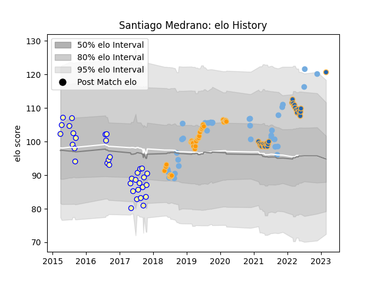

---  
layout: page  
title: Santiago Medrano  
date: 2022-11-22 11:31:20.002139  
categories: player  
---
# Santiago Medrano

## Positions: P

## Country: Argentina

## Current elo: 97.0

## Current Percentile: 58.0

# Elo History

# Match History

| Team                |   Appearances |   Win Rate |
|:--------------------|--------------:|-----------:|
| Argentina           |            33 |   0.30303  |
| Jaguares            |            30 |   0.6      |
| Western Force       |            28 |   0.285714 |
| Regatas Bella Vista |            23 |   0.369565 |

| Opponent                 |   Matches |   Win Rate |
|:-------------------------|----------:|-----------:|
| Brumbies                 |         7 |   0.285714 |
| New Zealand              |         6 |   0.166667 |
| South Africa             |         6 |   0.166667 |
| Bulls                    |         5 |   0.8      |
| Sharks                   |         5 |   0.6      |
| New South Wales Waratahs |         5 |   0.6      |
| Chiefs                   |         5 |   0.4      |
| Wales                    |         4 |   0.375    |
| Lions                    |         4 |   0.25     |
| Melbourne Rebels         |         4 |   0.5      |
| Hindu                    |         4 |   0        |
| Hurricanes               |         4 |   0.5      |
| Stormers                 |         4 |   0.5      |
| Australia                |         4 |   0.375    |
| Queensland Reds          |         3 |   0.333333 |
| San Luis                 |         3 |   0.333333 |
| Scotland                 |         3 |   0        |
| Alumni                   |         3 |   0.333333 |
| Crusaders                |         3 |   0        |
| Highlanders              |         3 |   0        |
| France                   |         3 |   0        |
| Blues                    |         3 |   0.333333 |
| CASI                     |         3 |   0.333333 |
| Belgrano                 |         2 |   0        |
| Newman                   |         2 |   1        |
| CUBA                     |         2 |   0.5      |
| Ireland                  |         1 |   0        |
| United States of America |         1 |   1        |
| Tonga                    |         1 |   1        |
| Sunwolves                |         1 |   1        |
| England                  |         1 |   0        |
| SIC                      |         1 |   0        |
| Italy                    |         1 |   1        |
| Pucara                   |         1 |   0.5      |
| Portugal                 |         1 |   1        |
| Fijian Drua              |         1 |   1        |
| Moana Pasifika           |         1 |   1        |
| Georgia                  |         1 |   1        |
| Atlético del Rosario     |         1 |   1        |
| La Plata                 |         1 |   1        |