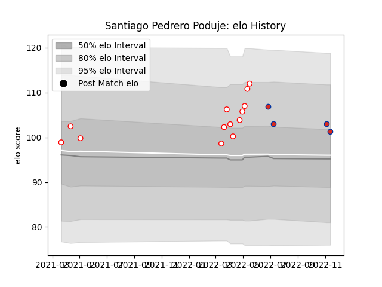

---  
layout: page  
title: Santiago Pedrero Poduje  
date: 2022-11-16 11:22:59.292853  
categories: player  
---
# Santiago Pedrero Poduje

## Positions: L

## Country: Chile

## Current elo: 101.0

## Current Percentile: 77.0

# Elo History

# Match History

| Team    |   Appearances |   Win Rate |
|:--------|--------------:|-----------:|
| Selknam |            13 |   0.769231 |
| Chile   |             4 |   0        |

| Opponent                 |   Matches |   Win Rate |
|:-------------------------|----------:|-----------:|
| Cafeteros Pro            |         3 |   1        |
| Cobras                   |         3 |   0.666667 |
| Olimpia Lions            |         3 |   0.666667 |
| Jaguares XV              |         2 |   1        |
| Penarol Rugby            |         2 |   0.5      |
| Romania                  |         1 |   0        |
| Scotland                 |         1 |   0        |
| Tonga                    |         1 |   0        |
| United States of America |         1 |   0        |