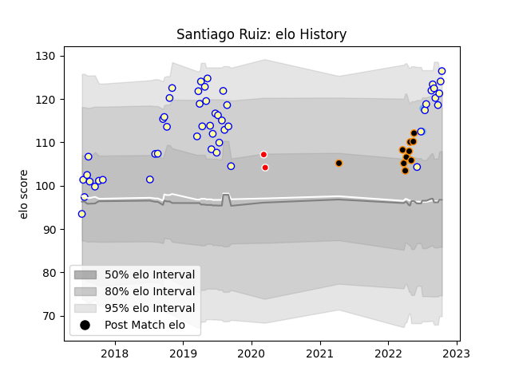

---  
layout: page  
title: Santiago Ruiz  
date: 2023-03-04 11:39:40.344222  
categories: player  
---
# Santiago Ruiz

## Positions: FL, N8

## Country: Argentina

## Current elo: 126.0

## Current Percentile: 93.0

# Elo History

# Match History

| Team                |   Appearances |   Win Rate |
|:--------------------|--------------:|-----------:|
| Regatas Bella Vista |            50 |       0.42 |
| Jaguares XV         |            10 |       0.6  |
| Argentina           |             2 |       1    |
| Ceibos Rugby        |             2 |       1    |

| Opponent             |   Matches |   Win Rate |
|:---------------------|----------:|-----------:|
| Newman               |         8 |   0.4375   |
| San Luis             |         6 |   0.333333 |
| Hindu                |         5 |   0.1      |
| Alumni               |         4 |   0        |
| SIC                  |         4 |   0.25     |
| Pucara               |         4 |   0.5      |
| Selknam              |         4 |   0.25     |
| CUBA                 |         4 |   1        |
| CASI                 |         4 |   0.75     |
| Belgrano             |         4 |   0.5      |
| Cobras               |         3 |   1        |
| Olimpia Lions        |         3 |   1        |
| Atlético del Rosario |         2 |   0.5      |
| La Plata             |         2 |   0        |
| Georgia              |         1 |   1        |
| Cafeteros Pro        |         1 |   1        |
| Lomas                |         1 |   1        |
| Los Tilos            |         1 |   0        |
| Penarol Rugby        |         1 |   0        |
| Portugal             |         1 |   1        |
| Buenos Aires         |         1 |   1        |