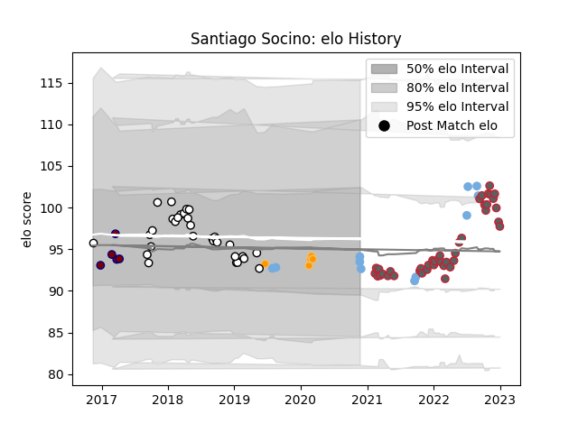

---  
layout: page  
title: Santiago Socino  
date: 2022-11-15 23:37:33.466403  
categories: player  
---
# Santiago Socino

## Positions: H

## Country: Argentina

## Current elo: 99.0

## Current Percentile: 71.0

# Elo History

# Match History

| Team              |   Appearances |   Win Rate |
|:------------------|--------------:|-----------:|
| Gloucester Rugby  |            36 |   0.597222 |
| Newcastle Falcons |            31 |   0.322581 |
| Argentina         |            10 |   0.35     |
| Jaguares          |             5 |   0.6      |
| Rotherham Titans  |             3 |   0        |

| Opponent            |   Matches |   Win Rate |
|:--------------------|----------:|-----------:|
| Exeter Chiefs       |         9 |   0.222222 |
| Wasps               |         7 |   0.571429 |
| Saracens            |         7 |   0.285714 |
| Bath Rugby          |         7 |   0.571429 |
| Bristol Rugby       |         5 |   0.4      |
| London Irish        |         5 |   0.9      |
| New Zealand         |         4 |   0.25     |
| Leicester Tigers    |         4 |   0.25     |
| Sale Sharks         |         4 |   0.5      |
| Newcastle Falcons   |         4 |   0.75     |
| Harlequins          |         4 |   0.25     |
| Australia           |         3 |   0.166667 |
| Worcester Warriors  |         2 |   1        |
| Northampton Saints  |         2 |   1        |
| Gloucester Rugby    |         2 |   0        |
| Bulls               |         1 |   1        |
| Brive               |         1 |   1        |
| Toulon              |         1 |   0        |
| Sunwolves           |         1 |   1        |
| Stormers            |         1 |   0        |
| South Africa        |         1 |   0        |
| Sharks              |         1 |   0        |
| Jersey              |         1 |   0        |
| Doncaster           |         1 |   0        |
| Queensland Reds     |         1 |   1        |
| Portugal            |         1 |   1        |
| Nottingham          |         1 |   0        |
| Edinburgh           |         1 |   0        |
| Georgia             |         1 |   1        |
| Montpellier Herault |         1 |   0        |
| RC Enisei           |         1 |   1        |