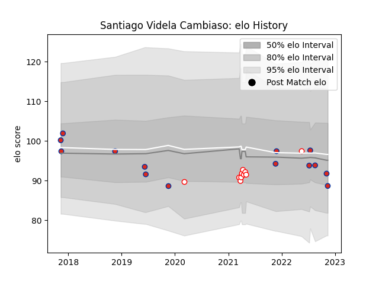

---  
layout: page  
title: Santiago Videla Cambiaso  
date: 2022-11-16 11:41:26.535535  
categories: player  
---
# Santiago Videla Cambiaso

## Positions: FH, FB

## Country: Chile

## Current elo: 89.0

## Current Percentile: 36.0

# Elo History

# Match History

| Team    |   Appearances |   Win Rate |
|:--------|--------------:|-----------:|
| Chile   |            14 |   0.428571 |
| Selknam |            10 |   0.6      |

| Opponent                 |   Matches |   Win Rate |
|:-------------------------|----------:|-----------:|
| Penarol Rugby            |         4 |       0.75 |
| Cafeteros Pro            |         2 |       1    |
| Cobras                   |         2 |       0.5  |
| Romania                  |         2 |       0    |
| Russia                   |         2 |       1    |
| United States of America |         2 |       0.5  |
| Brazil                   |         1 |       1    |
| Germany                  |         1 |       1    |
| Hong Kong                |         1 |       0    |
| Jaguares XV              |         1 |       0    |
| Kenya                    |         1 |       1    |
| New Zealand Maori        |         1 |       0    |
| Olimpia Lions            |         1 |       0    |
| Portugal                 |         1 |       0    |
| Spain                    |         1 |       0    |
| Tonga                    |         1 |       0    |