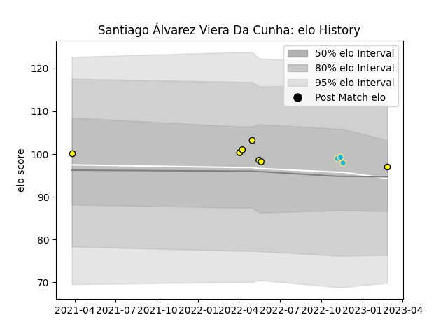

---  
layout: page  
title: Santiago Álvarez Viera Da Cunha  
date: 2023-03-21 18:05:32.328817  
categories: player  
---
# Santiago Álvarez Viera Da Cunha

Last updated: 2023-03-21
## Positions: SH

## Country: Uruguay

## Current elo: 97.0

## Current Percentile: 52.0

# Elo History

# Match History

| Team          |   Appearances |   Win Rate |
|:--------------|--------------:|-----------:|
| Penarol Rugby |            11 |   0.909091 |
| Uruguay       |             3 |   0.333333 |

| Opponent         |   Matches |   Win Rate |
|:-----------------|----------:|-----------:|
| Cafeteros Pro    |         3 |        1   |
| American Raptors |         2 |        1   |
| Selknam          |         2 |        0.5 |
| Cobras           |         1 |        1   |
| Dogos XV         |         1 |        1   |
| Georgia          |         1 |        0   |
| Jaguares XV      |         1 |        1   |
| Romania          |         1 |        1   |
| Tonga            |         1 |        0   |
| Yacare XV        |         1 |        1   |