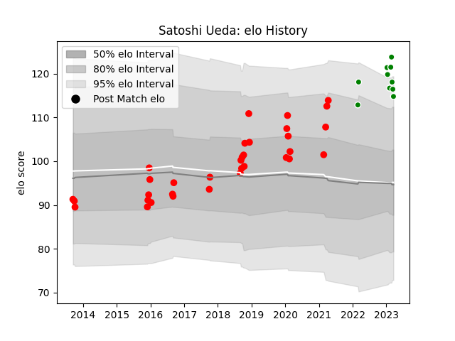

---  
layout: page  
title: Satoshi Ueda  
date: 2023-01-13 11:34:14.275263  
categories: player  
---
# Satoshi Ueda

## Positions: P

## Current elo: 125.0

## Current Percentile: 95.0

# Elo History

# Match History

| Team                  |   Appearances |   Win Rate |
|:----------------------|--------------:|-----------:|
| Yokohama Canon Eagles |            30 |       0.55 |
| Green Rockets Tokatsu |             4 |       0.25 |

| Opponent                          |   Matches |   Win Rate |
|:----------------------------------|----------:|-----------:|
| Shizuoka Blue Revs                |         5 |   0.2      |
| Black Rams Tokyo                  |         4 |   0.25     |
| Coca-Cola Red Sparks              |         4 |   1        |
| Green Rockets Tokatsu             |         3 |   1        |
| Kobelco Kobe Steelers             |         3 |   0.333333 |
| Hanazono Kintetsu Liners          |         2 |   1        |
| Kubota Spears Funabashi Tokyo-Bay |         2 |   0        |
| Mie Honda Heat                    |         2 |   0.25     |
| Saitama Wild Knights              |         2 |   0        |
| Toshiba Brave Lupus Tokyo         |         2 |   0.5      |
| Mitsubishi Dynaboars              |         1 |   1        |
| Munakata Sanix Blues              |         1 |   1        |
| NTT Docomo Red Hurricanes Osaka   |         1 |   0        |
| Toyota Industries Shuttles Aichi  |         1 |   1        |
| Toyota Verblitz                   |         1 |   1        |