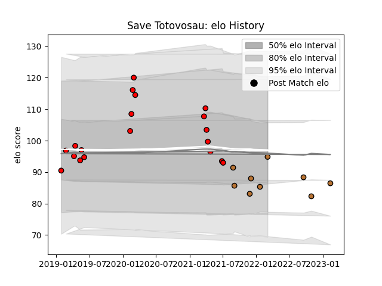

---  
layout: page  
title: Save Totovosau  
date: 2023-02-15 22:13:53.415424  
categories: player  
---
# Save Totovosau

## Positions: W

## Current elo: 95.0

## Current Percentile: 21.0

# Elo History

# Match History

| Team             |   Appearances |   Win Rate |
|:-----------------|--------------:|-----------:|
| San Diego Legion |            19 |   0.684211 |
| Narbonne         |             9 |   0.277778 |

| Opponent                   |   Matches |   Win Rate |
|:---------------------------|----------:|-----------:|
| R.U. New York              |         4 |        0.5 |
| NOLA Gold                  |         3 |        1   |
| Austin Elite Rugby         |         2 |        1   |
| Seattle Seawolves          |         2 |        1   |
| Mont-de-Marsan             |         2 |        0   |
| Austin Gilgronis           |         2 |        0.5 |
| Rugby ATL                  |         1 |        0   |
| Valence Romans Drome Rugby |         1 |        0   |
| Utah Warriors              |         1 |        1   |
| US Bressane                |         1 |        1   |
| Suresnes                   |         1 |        1   |
| New England Free Jacks     |         1 |        1   |
| Rouen                      |         1 |        0   |
| L. A. Giltinis             |         1 |        0   |
| Houston SaberCats          |         1 |        0   |
| Grenoble                   |         1 |        0   |
| Colorado Raptors           |         1 |        1   |
| Chambery                   |         1 |        0   |
| Vannes                     |         1 |        0.5 |