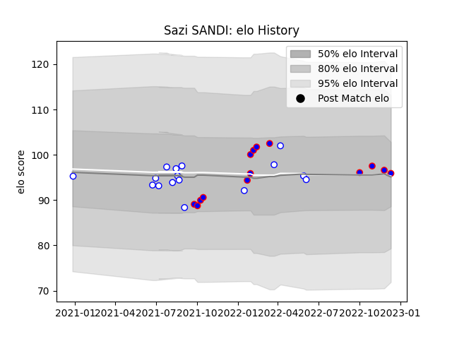

---  
layout: page  
title: Sazi SANDI  
date: 2023-01-31 16:09:04.681155  
categories: player  
---
# Sazi SANDI

## Positions: P

## Current elo: 90.0

## Current Percentile: 27.0

# Elo History

# Match History

| Team             |   Appearances |   Win Rate |
|:-----------------|--------------:|-----------:|
| Western Province |            15 |      0.5   |
| Stormers         |             8 |      0.625 |

| Opponent            |   Matches |   Win Rate |
|:--------------------|----------:|-----------:|
| Golden Lions        |         4 |       0.5  |
| Griquas             |         4 |       0.25 |
| Pumas               |         3 |       0.5  |
| Lions               |         2 |       1    |
| Natal Sharks        |         2 |       1    |
| Blue Bulls          |         1 |       0    |
| Clermont Auvergne   |         1 |       0    |
| Edinburgh           |         1 |       1    |
| Free State Cheetahs |         1 |       1    |
| Glasgow Warriors    |         1 |       0    |
| London Irish        |         1 |       1    |
| Scarlets            |         1 |       1    |
| Ulster              |         1 |       0    |