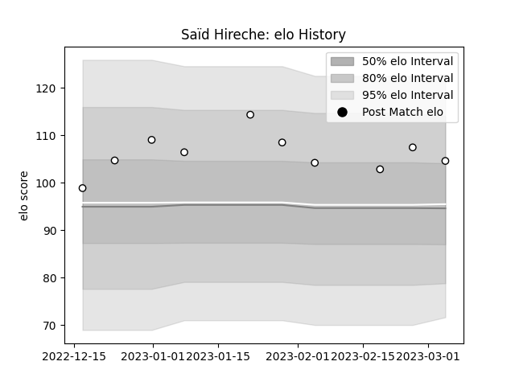

---  
layout: page  
title: Saïd HIRECHE  
date: 2023-02-02 18:41:23.345090  
categories: player  
---
# Saïd HIRECHE

## Positions: FL

## Current elo: 157.0

## Current Percentile: 99.0

# Elo History

# Match History

| Team                 |   Appearances |   Win Rate |
|:---------------------|--------------:|-----------:|
| Brive                |           226 |   0.528761 |
| Aurillac             |           102 |   0.529412 |
| Stade Francais Paris |             9 |   0.555556 |

| Opponent             |   Matches |   Win Rate |
|:---------------------|----------:|-----------:|
| Pau                  |        19 |   0.473684 |
| Lyon                 |        17 |   0.5      |
| Oyonnax              |        16 |   0.625    |
| La Rochelle          |        16 |   0.375    |
| Grenoble             |        15 |   0.466667 |
| Clermont Auvergne    |        15 |   0.333333 |
| Castres Olympique    |        14 |   0.571429 |
| Toulon               |        13 |   0.615385 |
| Bordeaux Begles      |        13 |   0.423077 |
| Stade Toulousain     |        12 |   0.333333 |
| Stade Francais Paris |        12 |   0.583333 |
| Racing 92            |        12 |   0.291667 |
| Agen                 |        11 |   0.454545 |
| Bayonne              |        10 |   0.55     |
| Provence Rugby       |        10 |   0.65     |
| Narbonne             |        10 |   0.55     |
| Montpellier Herault  |         9 |   0.611111 |
| Dax                  |         9 |   0.555556 |
| Auch                 |         8 |   0.375    |
| Tarbes               |         8 |   0.75     |
| Mont-de-Marsan       |         8 |   0.375    |
| Colomiers            |         7 |   0.857143 |
| Beziers              |         7 |   0.714286 |
| Albi                 |         6 |   0.583333 |
| Biarritz Olympique   |         6 |   0.416667 |
| Perpignan            |         5 |   0.4      |
| Carcassonne          |         4 |   0.5      |
| US Bressane          |         4 |   0.75     |
| Newcastle Falcons    |         4 |   0.75     |
| Worcester Warriors   |         3 |   0.666667 |
| Massy                |         3 |   0.666667 |
| RC Enisei            |         3 |   0.666667 |
| Aurillac             |         3 |   0.666667 |
| Saint-Etienne        |         2 |   1        |
| Connacht             |         2 |   0        |
| Lannemezan           |         2 |   1        |
| Bourgoin-Jallieu     |         2 |   0.5      |
| Vannes               |         2 |   1        |
| Périgueux            |         2 |   0.5      |
| Nevers               |         2 |   1        |
| Soyaux-Angouleme     |         2 |   1        |
| Bucuresti            |         2 |   1        |
| Calvisano            |         1 |   1        |
| Montauban            |         1 |   1        |
| Bath Rugby           |         1 |   0        |
| Gloucester Rugby     |         1 |   0        |
| Brive                |         1 |   0        |
| Cardiff Blues        |         1 |   1        |
| Zebre                |         1 |   0        |