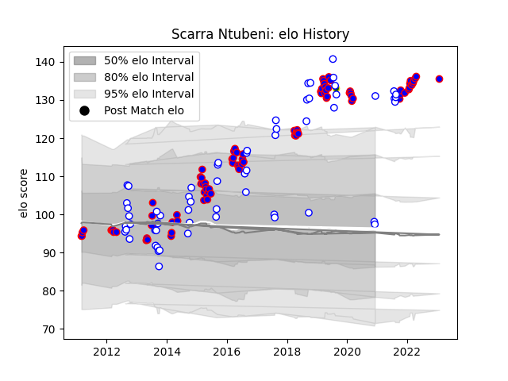

---  
layout: page  
title: Scarra Ntubeni  
date: 2023-02-02 19:13:45.421642  
categories: player  
---
# Scarra Ntubeni

## Positions: H

## Country: South Africa

## Current elo: 97.0

## Current Percentile: 98.0

# Elo History

# Match History

| Team             |   Appearances |   Win Rate |
|:-----------------|--------------:|-----------:|
| Stormers         |            90 |   0.611111 |
| Western Province |            60 |   0.675    |
| South Africa     |             1 |   1        |

| Opponent                 |   Matches |   Win Rate |
|:-------------------------|----------:|-----------:|
| Blue Bulls               |        13 |   0.576923 |
| Bulls                    |        12 |   0.666667 |
| Free State Cheetahs      |        11 |   0.636364 |
| Golden Lions             |        11 |   0.5      |
| Natal Sharks             |         9 |   0.555556 |
| Lions                    |         9 |   0.666667 |
| Sharks                   |         9 |   0.5      |
| Pumas                    |         7 |   0.928571 |
| Griquas                  |         7 |   1        |
| Cheetahs                 |         6 |   0.833333 |
| Hurricanes               |         6 |   0.666667 |
| Blues                    |         5 |   0.4      |
| Western Force            |         4 |   1        |
| Highlanders              |         4 |   0.75     |
| Jaguares                 |         4 |   0.75     |
| Brumbies                 |         4 |   0.5      |
| Melbourne Rebels         |         4 |   1        |
| Sunwolves                |         3 |   0.5      |
| New South Wales Waratahs |         3 |   0.333333 |
| Chiefs                   |         3 |   0        |
| Crusaders                |         2 |   0.25     |
| Southern Kings           |         2 |   1        |
| Eastern Province Kings   |         2 |   1        |
| Ulster                   |         1 |   0        |
| Queensland Reds          |         1 |   0        |
| Argentina                |         1 |   1        |
| Munster                  |         1 |   0        |
| Benetton Treviso         |         1 |   0        |
| Glasgow Warriors         |         1 |   1        |
| Edinburgh                |         1 |   0.5      |
| Dragons                  |         1 |   1        |
| Connacht                 |         1 |   0        |
| Cardiff Blues            |         1 |   1        |
| Zebre                    |         1 |   1        |