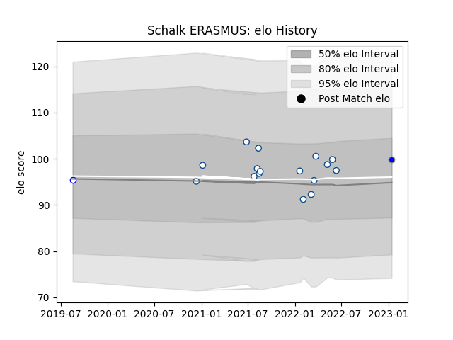

---  
layout: page  
title: Schalk ERASMUS  
date: 2023-03-27 11:36:09.129944  
categories: player  
---
# Schalk ERASMUS

Last updated: 2023-03-27
## Positions: H

## Current elo: 106.0

## Current Percentile: 79.0

# Elo History

# Match History

| Team                              |   Appearances |   Win Rate |
|:----------------------------------|--------------:|-----------:|
| Blue Bulls                        |            18 |   0.777778 |
| Kubota Spears Funabashi Tokyo-Bay |             5 |   0.8      |
| Western Province                  |             1 |   0        |

| Opponent                  |   Matches |   Win Rate |
|:--------------------------|----------:|-----------:|
| Golden Lions              |         5 |   1        |
| Griquas                   |         4 |   0.75     |
| Natal Sharks              |         3 |   0.333333 |
| Pumas                     |         3 |   1        |
| Free State Cheetahs       |         2 |   0        |
| Western Province          |         2 |   1        |
| Green Rockets Tokatsu     |         1 |   1        |
| Mitsubishi Dynaboars      |         1 |   1        |
| Saitama Wild Knights      |         1 |   0        |
| Toshiba Brave Lupus Tokyo |         1 |   1        |
| Yokohama Canon Eagles     |         1 |   1        |