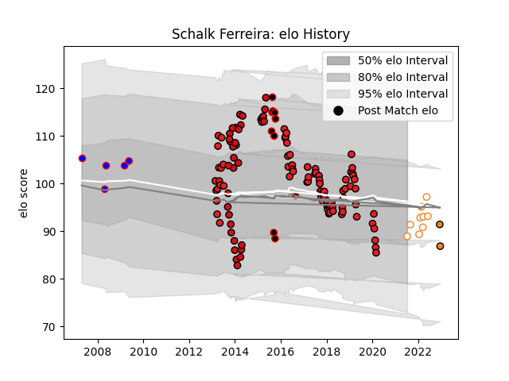

---  
layout: page  
title: Schalk Ferreira  
date: 2023-03-21 18:55:12.450807  
categories: player  
---
# Schalk Ferreira

Last updated: 2023-03-21
## Positions: P

## Current elo: 89.0

## Current Percentile: None

# Elo History

# Match History

| Team                   |   Appearances |   Win Rate |
|:-----------------------|--------------:|-----------:|
| Southern Kings         |            77 |   0.155844 |
| Stade Toulousain       |            35 |   0.628571 |
| Eastern Province Kings |            10 |   0.2      |
| Free State Cheetahs    |             9 |   0.777778 |
| Stormers               |             5 |   0.8      |
| Cheetahs               |             2 |   0.5      |

| Opponent                 |   Matches |   Win Rate |
|:-------------------------|----------:|-----------:|
| Cheetahs                 |        11 |  0.0909091 |
| Scarlets                 |         6 |  0         |
| Pumas                    |         5 |  0.4       |
| Bulls                    |         5 |  0.2       |
| Jaguares                 |         4 |  0.5       |
| Connacht                 |         4 |  0.25      |
| Ulster                   |         4 |  0         |
| Stormers                 |         4 |  0         |
| Sharks                   |         4 |  0         |
| Natal Sharks             |         4 |  0.5       |
| Munster                  |         4 |  0         |
| Leinster                 |         4 |  0         |
| Edinburgh                |         4 |  0.25      |
| Dragons                  |         4 |  0.375     |
| Zebre                    |         4 |  0.5       |
| Brive                    |         3 |  0.666667  |
| Montpellier Herault      |         3 |  0.333333  |
| Toulon                   |         3 |  0.666667  |
| Blue Bulls               |         3 |  0.333333  |
| Stade Francais Paris     |         3 |  0.833333  |
| Highlanders              |         3 |  0.666667  |
| Oyonnax                  |         3 |  0.5       |
| Lions                    |         3 |  0.333333  |
| Western Province         |         2 |  0.5       |
| Sunwolves                |         2 |  1         |
| Saracens                 |         2 |  1         |
| Perpignan                |         2 |  0.5       |
| Ospreys                  |         2 |  0         |
| Crusaders                |         2 |  0         |
| Bayonne                  |         2 |  0.5       |
| Grenoble                 |         2 |  0.5       |
| Chiefs                   |         2 |  0         |
| Cardiff Blues            |         2 |  0         |
| Benetton Treviso         |         2 |  0         |
| Castres Olympique        |         2 |  0.5       |
| Griquas                  |         2 |  1         |
| Glasgow Warriors         |         2 |  0.5       |
| Blues                    |         1 |  1         |
| Western Force            |         1 |  1         |
| Biarritz Olympique       |         1 |  1         |
| Free State Cheetahs      |         1 |  1         |
| Golden Lions             |         1 |  0         |
| Melbourne Rebels         |         1 |  1         |
| Boland Cavaliers         |         1 |  0         |
| Lyon                     |         1 |  1         |
| Racing 92                |         1 |  0         |
| Bordeaux Begles          |         1 |  1         |
| Pau                      |         1 |  1         |
| Hurricanes               |         1 |  0         |
| New South Wales Waratahs |         1 |  0         |
| Brumbies                 |         1 |  0.5       |
| Clermont Auvergne        |         1 |  1         |