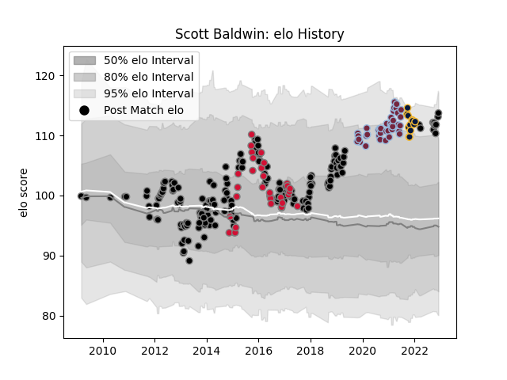

---  
layout: page  
title: Scott Baldwin  
date: 2022-12-09 13:06:09.096279  
categories: player  
---
# Scott Baldwin

## Positions: H

## Country: Wales

## Current elo: 114.0

## Current Percentile: 93.0

# Elo History

# Match History

| Team               |   Appearances |   Win Rate |
|:-------------------|--------------:|-----------:|
| Ospreys            |           183 |   0.54918  |
| Harlequins         |            38 |   0.565789 |
| Wales              |            31 |   0.596774 |
| Worcester Warriors |            12 |   0.291667 |

| Opponent             |   Matches |   Win Rate |
|:---------------------|----------:|-----------:|
| Dragons              |        17 |   0.882353 |
| Benetton Treviso     |        14 |   0.714286 |
| Scarlets             |        14 |   0.607143 |
| Cardiff Blues        |        14 |   0.928571 |
| Munster              |        13 |   0.192308 |
| Leinster             |        12 |   0.291667 |
| Northampton Saints   |        12 |   0.416667 |
| Glasgow Warriors     |        11 |   0.181818 |
| Zebre                |        10 |   0.9      |
| Ulster               |        10 |   0.2      |
| Edinburgh            |        10 |   0.7      |
| Exeter Chiefs        |         9 |   0.333333 |
| Connacht             |         9 |   0.666667 |
| Bristol Rugby        |         6 |   0.333333 |
| Newcastle Falcons    |         6 |   0.583333 |
| Sale Sharks          |         5 |   0.8      |
| England              |         5 |   0.2      |
| Bath Rugby           |         5 |   0.4      |
| Worcester Warriors   |         5 |   0.2      |
| London Irish         |         5 |   0.7      |
| Saracens             |         4 |   0.125    |
| Leicester Tigers     |         4 |   0.375    |
| Gloucester Rugby     |         4 |   0.75     |
| Clermont Auvergne    |         4 |   0.25     |
| Ireland              |         3 |   0.833333 |
| Italy                |         3 |   1        |
| Wasps                |         3 |   1        |
| Stade Francais Paris |         3 |   0.333333 |
| France               |         3 |   0.666667 |
| New Zealand          |         3 |   0        |
| South Africa         |         3 |   0.666667 |
| Scotland             |         3 |   0.666667 |
| Harlequins           |         2 |   0        |
| Australia            |         2 |   0        |
| Bordeaux Begles      |         2 |   0.5      |
| Stade Toulousain     |         2 |   0.5      |
| Castres Olympique    |         2 |   0.5      |
| Cheetahs             |         2 |   1        |
| Racing 92            |         2 |   0.25     |
| Fiji                 |         2 |   1        |
| Lyon                 |         2 |   1        |
| Lions                |         2 |   0        |
| Aironi               |         2 |   1        |
| Samoa                |         1 |   1        |
| Bulls                |         1 |   0        |
| Pau                  |         1 |   1        |
| Sharks               |         1 |   0        |
| Southern Kings       |         1 |   1        |
| Stormers             |         1 |   0.5      |
| Grenoble             |         1 |   1        |
| Uruguay              |         1 |   1        |
| Argentina            |         1 |   1        |
| Japan                |         1 |   1        |