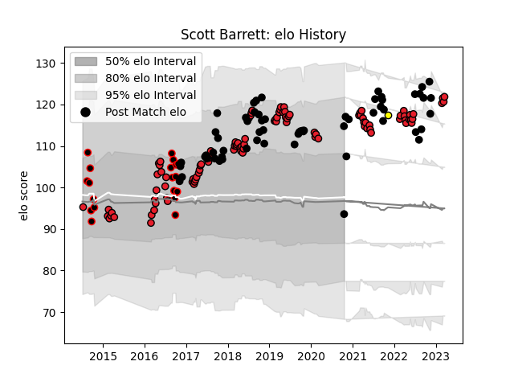

---  
layout: page  
title: Scott Barrett  
date: 2022-11-15 23:40:08.108034  
categories: player  
---
# Scott Barrett

## Positions: L

## Country: New Zealand

## Current elo: 123.0

## Current Percentile: 97.0

# Elo History

# Match History

| Team        |   Appearances |   Win Rate |
|:------------|--------------:|-----------:|
| Crusaders   |            96 |   0.822917 |
| New Zealand |            59 |   0.788136 |
| Canterbury  |            19 |   0.789474 |
| Taranaki    |             1 |   1        |

| Opponent                 |   Matches |   Win Rate |
|:-------------------------|----------:|-----------:|
| Chiefs                   |        14 |   0.571429 |
| Australia                |        13 |   0.769231 |
| Hurricanes               |        13 |   0.769231 |
| Highlanders              |        13 |   0.692308 |
| Blues                    |        12 |   0.916667 |
| Argentina                |         9 |   0.888889 |
| South Africa             |         9 |   0.666667 |
| France                   |         6 |   1        |
| Queensland Reds          |         6 |   1        |
| Ireland                  |         6 |   0.5      |
| Lions                    |         6 |   0.833333 |
| Brumbies                 |         5 |   1        |
| Melbourne Rebels         |         5 |   0.8      |
| New South Wales Waratahs |         5 |   1        |
| Western Force            |         3 |   1        |
| Wales                    |         3 |   1        |
| Counties Manukau         |         3 |   0.666667 |
| Bulls                    |         3 |   1        |
| Stormers                 |         3 |   0.833333 |
| British and Irish Lions  |         3 |   0.5      |
| Sharks                   |         3 |   0.833333 |
| Waikato                  |         2 |   1        |
| Tonga                    |         2 |   1        |
| Tasman                   |         2 |   0.5      |
| Taranaki                 |         2 |   1        |
| England                  |         2 |   0.5      |
| Otago                    |         2 |   1        |
| Italy                    |         2 |   1        |
| North Harbour            |         2 |   0.5      |
| Auckland                 |         2 |   1        |
| Cheetahs                 |         2 |   1        |
| Wellington               |         1 |   1        |
| Fijian Drua              |         1 |   1        |
| Hawke's Bay              |         1 |   1        |
| Canada                   |         1 |   1        |
| Northland                |         1 |   1        |
| Sunwolves                |         1 |   1        |
| Fiji                     |         1 |   1        |
| Southland                |         1 |   1        |
| Manawatu                 |         1 |   0        |
| Scotland                 |         1 |   1        |
| Samoa                    |         1 |   1        |
| Jaguares                 |         1 |   1        |