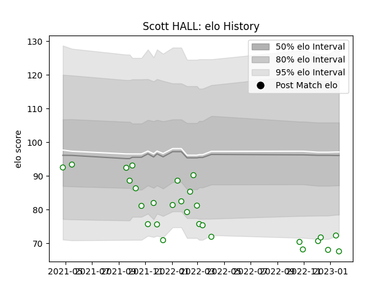

---  
layout: page  
title: Scott HALL  
date: 2023-01-30 18:30:41.653877  
categories: player  
---
# Scott HALL

## Positions: L, FL

## Current elo: 68.0

## Current Percentile: 5.0

# Elo History

# Match History

| Team       |   Appearances |   Win Rate |
|:-----------|--------------:|-----------:|
| Nottingham |            28 |       0.25 |

| Opponent            |   Matches |   Win Rate |
|:--------------------|----------:|-----------:|
| Jersey              |         4 |   0        |
| Richmond            |         4 |   0.5      |
| Bedford             |         3 |   0        |
| Cornish Pirates     |         3 |   0        |
| Coventry            |         3 |   0.333333 |
| Ealing Trailfinders |         3 |   0        |
| Doncaster           |         2 |   0        |
| Hartpury College    |         2 |   0.5      |
| London Scottish     |         2 |   1        |
| Ampthill            |         1 |   1        |
| Caldy               |         1 |   0        |