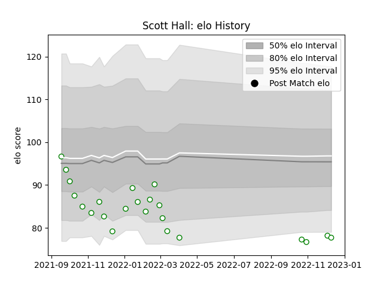

---  
layout: page  
title: Scott Hall  
date: 2022-12-18 16:39:17.601118  
categories: player  
---
# Scott Hall

## Positions: L, N8

## Current elo: 78.0

## Current Percentile: 4.0

# Elo History

# Match History

| Team       |   Appearances |   Win Rate |
|:-----------|--------------:|-----------:|
| Nottingham |            23 |    0.26087 |

| Opponent            |   Matches |   Win Rate |
|:--------------------|----------:|-----------:|
| Bedford             |         3 |   0        |
| Ealing Trailfinders |         3 |   0        |
| Jersey              |         3 |   0        |
| Richmond            |         3 |   0.333333 |
| Cornish Pirates     |         2 |   0        |
| Coventry            |         2 |   0.5      |
| Doncaster           |         2 |   0        |
| Hartpury College    |         2 |   0.5      |
| London Scottish     |         2 |   1        |
| Ampthill            |         1 |   1        |