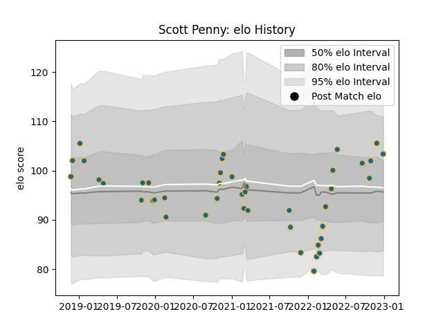

---  
layout: page  
title: Scott Penny  
date: 2023-01-06 00:23:45.578338  
categories: player  
---
# Scott Penny

## Positions: FL

## Current elo: 111.0

## Current Percentile: 74.0

# Elo History

# Match History

| Team     |   Appearances |   Win Rate |
|:---------|--------------:|-----------:|
| Leinster |            44 |   0.806818 |

| Opponent         |   Matches |   Win Rate |
|:-----------------|----------:|-----------:|
| Ulster           |         7 |   0.571429 |
| Ospreys          |         5 |   0.8      |
| Zebre            |         5 |   1        |
| Dragons          |         4 |   1        |
| Glasgow Warriors |         4 |   1        |
| Munster          |         4 |   1        |
| Connacht         |         3 |   0.666667 |
| Benetton Treviso |         2 |   0.75     |
| Cardiff Blues    |         2 |   0.5      |
| Edinburgh        |         2 |   1        |
| Scarlets         |         2 |   1        |
| Cheetahs         |         1 |   1        |
| Lions            |         1 |   1        |
| Sharks           |         1 |   0        |
| Stormers         |         1 |   0        |