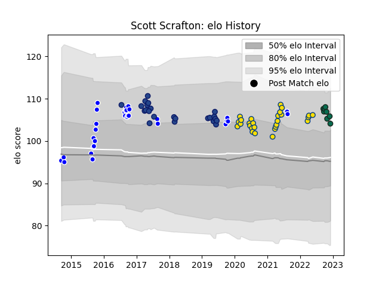

---  
layout: page  
title: Scott Scrafton  
date: 2023-01-06 00:23:13.911208  
categories: player  
---
# Scott Scrafton

## Positions: L

## Current elo: 118.0

## Current Percentile: 87.0

# Elo History

# Match History

| Team             |   Appearances |   Win Rate |
|:-----------------|--------------:|-----------:|
| Auckland         |            31 |   0.564516 |
| Hurricanes       |            27 |   0.518519 |
| Blues            |            23 |   0.521739 |
| Benetton Treviso |             9 |   0.555556 |

| Opponent                 |   Matches |   Win Rate |
|:-------------------------|----------:|-----------:|
| Chiefs                   |         8 |   0.5625   |
| Highlanders              |         6 |   0.5      |
| Crusaders                |         5 |   0.2      |
| Blues                    |         5 |   0.2      |
| Northland                |         4 |   1        |
| Canterbury               |         4 |   0.25     |
| Tasman                   |         4 |   0.25     |
| Melbourne Rebels         |         3 |   1        |
| Stormers                 |         3 |   0.333333 |
| Taranaki                 |         3 |   0.333333 |
| Hurricanes               |         3 |   0        |
| Counties Manukau         |         3 |   0.333333 |
| Sunwolves                |         3 |   0.666667 |
| Southland                |         3 |   0.833333 |
| New South Wales Waratahs |         2 |   1        |
| Otago                    |         2 |   1        |
| Bay of Plenty            |         2 |   1        |
| Glasgow Warriors         |         2 |   0.5      |
| Hawke's Bay              |         2 |   0.5      |
| Waikato                  |         2 |   0.5      |
| Bulls                    |         2 |   0.25     |
| Brumbies                 |         2 |   0.5      |
| Western Force            |         2 |   1        |
| Queensland Reds          |         2 |   0.5      |
| Sharks                   |         1 |   1        |
| Wellington               |         1 |   0        |
| Lions                    |         1 |   1        |
| Scarlets                 |         1 |   1        |
| Moana Pasifika           |         1 |   0        |
| Manawatu                 |         1 |   1        |
| Leinster                 |         1 |   0        |
| Edinburgh                |         1 |   1        |
| Dragons                  |         1 |   1        |
| Connacht                 |         1 |   0        |
| Cheetahs                 |         1 |   1        |
| British and Irish Lions  |         1 |   1        |
| Zebre                    |         1 |   1        |